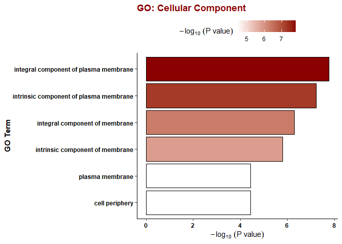
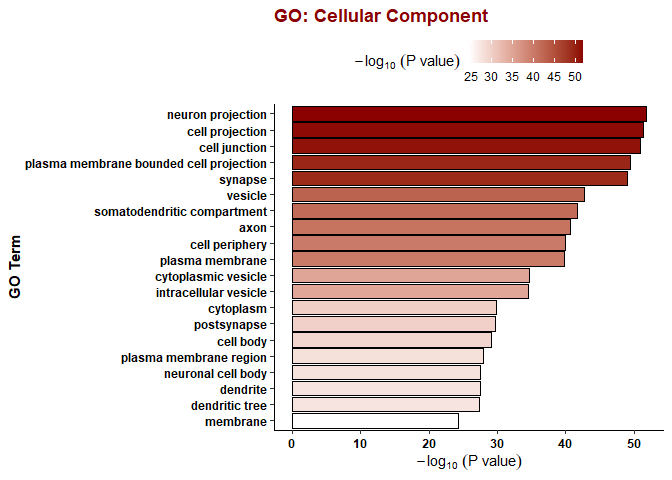

GO Analysis and Venn Diagrams
================
Ashlyn Johnson

``` r
library(gprofiler2)
library(tidyverse)
library(readxl)
library(janitor)
library(VennDiagram)
library(magick)
library(writexl)
sessionInfo()
```

    ## R version 4.1.1 (2021-08-10)
    ## Platform: x86_64-w64-mingw32/x64 (64-bit)
    ## Running under: Windows 10 x64 (build 19044)
    ## 
    ## Matrix products: default
    ## 
    ## locale:
    ## [1] LC_COLLATE=English_United States.1252 
    ## [2] LC_CTYPE=English_United States.1252   
    ## [3] LC_MONETARY=English_United States.1252
    ## [4] LC_NUMERIC=C                          
    ## [5] LC_TIME=English_United States.1252    
    ## 
    ## attached base packages:
    ## [1] grid      stats     graphics  grDevices utils     datasets  methods  
    ## [8] base     
    ## 
    ## other attached packages:
    ##  [1] writexl_1.4.0       magick_2.7.3        VennDiagram_1.6.20 
    ##  [4] futile.logger_1.4.3 janitor_2.1.0       readxl_1.3.1       
    ##  [7] forcats_0.5.1       stringr_1.4.0       dplyr_1.0.7        
    ## [10] purrr_0.3.4         readr_2.0.1         tidyr_1.1.3        
    ## [13] tibble_3.1.4        ggplot2_3.3.5       tidyverse_1.3.1    
    ## [16] gprofiler2_0.2.1   
    ## 
    ## loaded via a namespace (and not attached):
    ##  [1] Rcpp_1.0.7           lubridate_1.7.10     assertthat_0.2.1    
    ##  [4] digest_0.6.27        utf8_1.2.2           R6_2.5.1            
    ##  [7] cellranger_1.1.0     futile.options_1.0.1 backports_1.2.1     
    ## [10] reprex_2.0.1         evaluate_0.14        httr_1.4.2          
    ## [13] pillar_1.6.2         rlang_0.4.11         lazyeval_0.2.2      
    ## [16] rstudioapi_0.13      data.table_1.14.0    rmarkdown_2.10      
    ## [19] htmlwidgets_1.5.3    munsell_0.5.0        broom_0.7.9         
    ## [22] compiler_4.1.1       modelr_0.1.8         xfun_0.25           
    ## [25] pkgconfig_2.0.3      htmltools_0.5.2      tidyselect_1.1.1    
    ## [28] fansi_0.5.0          viridisLite_0.4.0    crayon_1.4.1        
    ## [31] tzdb_0.1.2           dbplyr_2.1.1         withr_2.4.2         
    ## [34] jsonlite_1.7.2       gtable_0.3.0         lifecycle_1.0.0     
    ## [37] DBI_1.1.1            formatR_1.11         magrittr_2.0.1      
    ## [40] scales_1.1.1         cli_3.0.1            stringi_1.7.4       
    ## [43] fs_1.5.0             snakecase_0.11.0     xml2_1.3.2          
    ## [46] ellipsis_0.3.2       generics_0.1.0       vctrs_0.3.8         
    ## [49] lambda.r_1.2.4       tools_4.1.1          glue_1.4.2          
    ## [52] hms_1.1.0            fastmap_1.1.0        yaml_2.2.1          
    ## [55] colorspace_2.0-2     rvest_1.0.1          plotly_4.9.4.1      
    ## [58] knitr_1.33           haven_2.4.3

I discovered two main issues in the gene/protein lists that I want to
compare that need correction.

First, some symbols in the nanostring dataset are actually referring to
two genes (i.e. C4A/B). This was done because the probe likely covers a
sequence that’s common to both symbols. However, since the symbols were
written this way, I was not able to match those genes to their
corresponding protein data. My solution for this will be to duplicate
the rows in which this naming pattern occurs and change the names of the
rows to be for a single gene (i.e. C4A and C4B).

Second, some of the HGNC symbols in the proteomic dataset (which was
generated in 2017) are outdated. I discovered this by looking up the
gene symbols of the nanostring dataset on a website like genecards.org
and finding their corresponding Uniprot IDs or previous HGNC symbols. I
would then use that information to search the proteomic dataset to
determine if in fact the gene that I was searching for was in the
proteomic data, just under a different HGNC symbol. For these scenarios,
I will change the name of the symbol in the proteomic dataset to the
updated symbol that would correspond to the nanostring dataset.

Records of my manual search can be found
[here](genelists_for_omiccomparisons/verification_workbook.xlsx)

Note, to make my function work, I had to rename TPSAB1/B2 to TPSAB1/2.
All other instances of the “/” only separated one character.

# Records of Manual Verification and Functions to Fix the Dataframes

``` r
# identifying which symbols I will need to fix 

## reading in verification workbook as individual dataframes 
### 1 in the 'Not in Proteomics' column indicates that the corresponding protein for that symbol was not in the proteomic dataset. 1 in the 'In Proteomics?' column indicates that the corresponding protein for that symbol was in the proteomic dataset. Notes column indicates why/how the nanostring symbol failed to match as well as other pertinent notes. 

beforebatchcorrection_verification <- read_xlsx("genelists_for_omiccomparisons/verification_workbook.xlsx", sheet = 1)
afterbatchcorrection_verification <- read_xlsx("genelists_for_omiccomparisons/verification_workbook.xlsx", sheet = 2)
diffex_verification <- read_xlsx <- read_xlsx("genelists_for_omiccomparisons/verification_workbook.xlsx", sheet = 3)

## filtering for rows with something in the 'Notes' column because those are going to be the symbols that need fixing. 

beforebatchcorrection_verification %>% filter(str_detect(Notes, "0") == FALSE) %>% print()
```

    ## # A tibble: 17 x 4
    ##    Probe.Label `Not in Proteomics` `In Proteomics?` Notes                       
    ##    <chr>                     <dbl>            <dbl> <chr>                       
    ##  1 SELENOS                       0                1 under previous HGNC symbol,~
    ##  2 ADGRA2                        0                1 under previous HGNC symbol,~
    ##  3 TPSAB1/B2                     1                0 This codes for two proteins~
    ##  4 ATP5F1B                       0                1 In proteomics under previou~
    ##  5 ADGRG1                        0                1 In proteomics under previou~
    ##  6 HACD2                         0                1 In proteomics, under previo~
    ##  7 ATP5PB                        0                1 In proteomics, under previo~
    ##  8 SRPRA                         0                1 In proteomics, under previo~
    ##  9 MYORG                         0                1 In proteomics, under previo~
    ## 10 ELOC                          0                1 In proteomics, under previo~
    ## 11 CSNK2A1/3                     0                1 2 different genes. Both are~
    ## 12 GRK3                          0                1 In proteomics, under previo~
    ## 13 MMUT                          0                1 In proteomics, under previo~
    ## 14 C4A/B                         0                1 In proteomics, actually 2 g~
    ## 15 FCGR3A/B                      0                1 In proteomics, 2 genes, FCG~
    ## 16 ADGRL4                        0                1 In proteomics, under previo~
    ## 17 FCGR1A/B                      0                1 In proteomics, this symbol ~

``` r
afterbatchcorrection_verification %>% filter(str_detect(Notes, "0") == FALSE) %>% print()
```

    ## # A tibble: 17 x 4
    ##    Probe.Label `Not in Proteomics` `In Proteomics?` Notes                       
    ##    <chr>                     <dbl>            <dbl> <chr>                       
    ##  1 SELENOS                       0                1 under previous HGNC symbol,~
    ##  2 ADGRA2                        1                0 under previous HGNC symbol,~
    ##  3 TPSAB1/B2                     1                0 This codes for two proteins~
    ##  4 ATP5F1B                       0                1 In proteomics under previou~
    ##  5 ADGRG1                        0                1 In proteomics under previou~
    ##  6 HACD2                         1                0 In before batch correction ~
    ##  7 ATP5PB                        0                1 In proteomics, under previo~
    ##  8 SRPRA                         0                1 In proteomics, under previo~
    ##  9 MYORG                         1                0 In before batch correction ~
    ## 10 ELOC                          0                1 In proteomics, under previo~
    ## 11 CSNK2A1/3                     0                1 2 different genes. Both are~
    ## 12 GRK3                          0                1 In proteomics, under previo~
    ## 13 MMUT                          0                1 In proteomics, under previo~
    ## 14 C4A/B                         0                1 In proteomics, actually 2 g~
    ## 15 FCGR3A/B                      1                0 In before batch correction ~
    ## 16 ADGRL4                        1                0 In before batch correction ~
    ## 17 FCGR1A/B                      0                1 In proteomics, this symbol ~

``` r
diffex_verification %>% filter(str_detect(Notes, "0") == FALSE) %>% print()
```

    ## # A tibble: 3 x 4
    ##   Probe.Label `Not in Proteomics` `In Proteomics?` Notes                        
    ##   <chr>                     <dbl>            <dbl> <chr>                        
    ## 1 C4A/B                         0                1 C4A is in the diffex proteom~
    ## 2 ELOC                          0                1 Under TCEB1                  
    ## 3 CSNK2A1/3                     1                0 Note for later that this is ~

``` r
## function to fix nanostring dataframes 
correct_nanostring_gene_symbols <- function(df) {
  rbind(
    df %>%
      filter(str_detect(Probe.Label, "/") == FALSE),
    
    df %>%
      filter(str_detect(Probe.Label, "/")) %>%
      mutate(Probe.Label = str_remove_all(Probe.Label, "/[:alnum:]")),
    
    df %>%
      filter(str_detect(Probe.Label, "/")) %>%
      mutate(Probe.Label = str_remove_all(Probe.Label, "[:alnum:]/"))
  )
}

## function to fix proteomics dataframes 
update_proteomic_gene_symbols <- function(df) {
  df %>% 
    mutate(protein = str_replace_all(protein, c("VIMP" = "SELENOS", 
                                                "GPR124" = "ADGRA2", 
                                                "ATP5B" = "ATP5F1B", 
                                                "GPR56" = "ADGRG1", 
                                                "PTPLB" = "HACD2", 
                                                "ATP5F1" = "ATP5PB", 
                                                "SRPR" = "SRPRA", 
                                                "KIAA1161" = "MYORG", 
                                                "TCEB1" = "ELOC", 
                                                "ADRBK2" = "GRK3", 
                                                "MUT" = "MMUT",
                                                "ELTD1" = "ADGRL4")))
}
```

# Initial Data Importing and Cleaning

``` r
###########################Nanostring Data Cleaning#######################
nanostring_heatmap_anno <- read_csv("raw_data/heatmap of all genes X samples probe.annot.csv") %>% 
  dplyr::mutate(ProbeID_short = str_remove_all(ProbeID, "\\.\\d+:\\d+")) %>% 
  dplyr::mutate(Probe.Label = str_replace_all(Probe.Label, c("TPSAB1/B2" = "TPSAB1/2"))) # had to do this to make my function to fix the nanostring gene symbols work
```

    ## New names:
    ## * `` -> ...1

    ## Rows: 757 Columns: 13

    ## -- Column specification --------------------------------------------------------
    ## Delimiter: ","
    ## chr (10): ...1, ProbeID, Codeset.Name, Probe.Label, Analyte.Type, Probe.Anno...
    ## dbl  (1): Is.Control
    ## lgl  (2): Control.Type, below.threshold

    ## 
    ## i Use `spec()` to retrieve the full column specification for this data.
    ## i Specify the column types or set `show_col_types = FALSE` to quiet this message.

``` r
# nanostring genes that met threshold
nanostring_above_threshold <- nanostring_heatmap_anno %>% 
 filter(below.threshold == FALSE) %>% 
  select(Probe.Label, ProbeID, ProbeID_short) %>% 
  correct_nanostring_gene_symbols()
  

# nanostring genes that didn't meet threshold 
nanostring_below_threshold <- nanostring_heatmap_anno %>% 
 filter(below.threshold == TRUE) %>% 
  select(Probe.Label, ProbeID, ProbeID_short) %>% 
  correct_nanostring_gene_symbols()

# significantly differentially expressed genes in FTD
nanostring_diffex_FTD <- read_csv("raw_data/DEresults-DiseaseFTD.csv") %>% 
  dplyr::rename(Probe.Label = 1) %>% 
  dplyr::mutate(ProbeID_short = str_remove_all(probe.ID, "\\.\\d+:\\d+"), 
                Probe.Label = str_remove_all(Probe.Label, "-mRNA")) %>% 
  dplyr::mutate(Probe.Label = str_replace_all(Probe.Label, c("TPSAB1/B2" = "TPSAB1/2"))) %>% 
  filter(BY.p.value < .05) %>% 
  correct_nanostring_gene_symbols()
```

    ## New names:
    ## * `` -> ...1

    ## Rows: 682 Columns: 13

    ## -- Column specification --------------------------------------------------------
    ## Delimiter: ","
    ## chr (4): ...1, method, Gene.sets, probe.ID
    ## dbl (9): Log2 fold change, std error (log2), Lower confidence limit (log2), ...

    ## 
    ## i Use `spec()` to retrieve the full column specification for this data.
    ## i Specify the column types or set `show_col_types = FALSE` to quiet this message.

``` r
#########################Proteomic Data Cleaning#####################################

# proteins before batch correction 
proteins_beforecorrection <- read_xlsx("raw_data/chales_10batch_tmt_beforecorrection.xlsx", sheet = 1) %>% 
  slice(-1:-3) %>% 
  select(1,2) %>% 
  rename(protein_id = 1, 
         protein = 2) %>% 
  update_proteomic_gene_symbols()
```

    ## New names:
    ## * `` -> ...1
    ## * `` -> ...2
    ## * `` -> ...3
    ## * `` -> ...4
    ## * `` -> ...5
    ## * ...

``` r
# just the protein/gene symbols (don't need to apply function because I did it to the dataframe above)
proteins_beforecorrection_unique <- proteins_beforecorrection$protein %>% 
  unique() %>% 
  as.data.frame() %>% 
  rename(protein = 1)

# larger data frame of proteins left after batch correction 
proteomics_diffex <- read_xlsx("raw_data/TMT17.xlsx", sheet = "OriginalTMT2017") %>% 
  dplyr::rename(protein = `...1`, 
         protein_id = `...2`, 
         pval = `Pr(>F)`) %>% 
  clean_names() %>% 
  update_proteomic_gene_symbols()
```

    ## New names:
    ## * `` -> ...1
    ## * `` -> ...2

``` r
# proteins left after batch correction (don't need to apply function because I did it to the dataframe above)
proteins_aftercorrection <- proteomics_diffex %>% 
  select(protein, protein_id)


# just the protein/gene symbols 
proteins_aftercorrection_unique <- proteins_aftercorrection$protein %>% 
  unique() %>% 
  as.data.frame() %>% 
  rename(protein = 1)

# significantly differentially expressed proteins in FTD (don't need to apply function because it was already applied to proteomics_diffex)
proteomics_diffex_FTD <-  proteomics_diffex %>%
  dplyr::select(protein,
         protein_id,
         f_value,
         pval,
         diff_ftdp_control,
         ftdp_control) %>% 
  dplyr::rename(posthoc_pval = ftdp_control) %>% 
  filter(posthoc_pval < .05)

write_xlsx(proteomics_diffex_FTD, "genelists_for_omiccomparisons/proteomics_diffex_FTD_2.xlsx")

proteomics_diffex_FTD_unique <- proteomics_diffex_FTD$protein %>% unique()
```

# Comparisons

## Comparison of Glial Panel with Before Batch Correction (BC) Proteins

``` r
# data frame with nanostring probes that were above threshold and a logical column that indicates whether or not that gene was in the proteomics data 
abovethreshnano_inbcproteomics <- data.frame(nanostring_above_threshold, in_bc_proteomics = nanostring_above_threshold$Probe.Label %in% proteins_beforecorrection_unique$protein) 

# number of genes that are detected via both nanostring and proteomics 
abovethreshnano_inbcproteomics %>% filter(in_bc_proteomics == TRUE) %>% pull(Probe.Label) %>% length()
```

    ## [1] 584

``` r
write_xlsx(abovethreshnano_inbcproteomics %>% filter(in_bc_proteomics == TRUE), "genelists_for_omiccomparisons/abovethreshnano_inbcproteomics_TRUE_2.xlsx")


# number of genes that are detected in nanostring but not proteomics 
abovethreshnano_inbcproteomics %>% filter(in_bc_proteomics == FALSE) %>% pull(Probe.Label) %>% length()
```

    ## [1] 103

``` r
write_xlsx(abovethreshnano_inbcproteomics %>% filter(in_bc_proteomics == FALSE), "genelists_for_omiccomparisons/abovethreshnano_inbcproteomics_FALSE_2.xlsx")

# above_thresh_nano_inbcproteomics %>% filter(in_proteomics == FALSE) %>% write_csv(file = "processed_data/nanogenes_notin_correctedproteomics.csv") # writing results as csv

# getting character vectors of gene lists 

abovethreshnano_inbcproteomics_FALSE <- abovethreshnano_inbcproteomics %>% 
  filter(in_bc_proteomics == FALSE) %>% 
  pull(ProbeID_short)

abovethreshnano_inbcproteomics_TRUE <- abovethreshnano_inbcproteomics %>% 
  filter(in_bc_proteomics == TRUE) %>% 
  pull(ProbeID_short)
```

## Comparison of Glial Panel with After Batch Correction (AC) Proteins

``` r
# data frame with nanostring probes that were above threshold and a logical column that indicates whether that gene was in the proteomics data 
abovethreshnano_inacproteomics <- data.frame(nanostring_above_threshold, in_ac_proteomics = nanostring_above_threshold$Probe.Label %in% proteins_aftercorrection_unique$protein) 

# number of genes that are detected via both nanostring and proteomics 
abovethreshnano_inacproteomics %>% filter(in_ac_proteomics == TRUE) %>% pull(Probe.Label) %>% length()
```

    ## [1] 429

``` r
write_xlsx(abovethreshnano_inacproteomics %>% filter(in_ac_proteomics == TRUE), "genelists_for_omiccomparisons/abovethreshnano_inacproteomics_TRUE_2.xlsx")


# number of genes that are detected in nanostring but not proteomics 
abovethreshnano_inacproteomics %>% filter(in_ac_proteomics == FALSE) %>% pull(Probe.Label) %>% length()
```

    ## [1] 258

``` r
write_xlsx(abovethreshnano_inacproteomics %>% filter(in_ac_proteomics == FALSE), "genelists_for_omiccomparisons/abovethreshnano_inacproteomics_FALSE_2.xlsx")

# above_thresh_nano_in_proteomics %>% filter(in_proteomics == FALSE) %>% write_csv(file = "processed_data/nanogenes_notin_correctedproteomics.csv") # writing results as csv

# getting charactger vectors of gene lists 

abovethreshnano_inacproteomics_FALSE <- abovethreshnano_inacproteomics %>% 
  filter(in_ac_proteomics == FALSE) %>% 
  pull(ProbeID_short)

abovethreshnano_inacproteomics_TRUE <- abovethreshnano_inacproteomics %>% 
  filter(in_ac_proteomics == TRUE) %>% 
  pull(ProbeID_short)
```

## DEG and DEP comparison

``` r
# data frame with nanostring probes that were above threshold and a logical column that indicates whether that gene was in the proteomics data 
degnano_indiffexproteomics <- data.frame(nanostring_diffex_FTD, in_diffex_proteomics = nanostring_diffex_FTD$Probe.Label %in% proteomics_diffex_FTD_unique) 

# number of genes that are detected via both nanostring and proteomics 
degnano_indiffexproteomics %>% filter(in_diffex_proteomics == TRUE) %>% pull(Probe.Label) %>% length()
```

    ## [1] 40

``` r
write_xlsx(degnano_indiffexproteomics %>% filter(in_diffex_proteomics == TRUE), "genelists_for_omiccomparisons/degnano_indiffexproteomics_TRUE_2.xlsx")


# number of genes that are detected in nanostring but not proteomics 
degnano_indiffexproteomics %>% filter(in_diffex_proteomics == FALSE) %>% pull(Probe.Label) %>% length()
```

    ## [1] 91

``` r
write_xlsx(degnano_indiffexproteomics %>% filter(in_diffex_proteomics == FALSE), "genelists_for_omiccomparisons/degnano_indiffexproteomics_FALSE_2.xlsx")

# above_thresh_nano_inbcproteomics %>% filter(in_proteomics == FALSE) %>% write_csv(file = "processed_data/nanogenes_notin_correctedproteomics.csv") # writing results as csv

# getting character vectors of gene lists 

degnano_indiffexproteomics_FALSE <- degnano_indiffexproteomics %>% 
  filter(in_diffex_proteomics == FALSE) %>% 
  pull(ProbeID_short)

degnano_indiffexproteomics_TRUE <- degnano_indiffexproteomics %>% 
  filter(in_diffex_proteomics == TRUE) %>% 
  pull(ProbeID_short)
```

# Venn Diagrams

## Glial Panel vs BC Proteins

``` r
home_wd <- getwd()
setwd(paste0(home_wd, "/figures/venn_diagrams"))

# venn diagrams

venn.diagram(
  x = list(nanostring_above_threshold$Probe.Label, proteins_beforecorrection_unique$protein), 
  category.names = c("Glial Profiling Panel", "Proteomics"), 
  filename = "abovethreshnanovsbcproteins_2.png", 
  output = TRUE, 
  imagetype = "png", 
  resolution = 600,
  width = 700, 
  height = 700,
  fill = c("navy", "#fdae61"),
  force.unique = TRUE, 
  
  # circles
  lty = 'blank',
  
  # numbers 
  
  cex = c(.25, .4, .4), 
  fontface = "bold",
  fontfamily = "sans",
  label.col = c("black", "#d7191c", "black"),
  
  # set names
  
  cat.cex = .4, 
  cat.fontface = "bold", 
  cat.default.pos = "outer",
  cat.pos = c(180, 0),
  cat.fontfamily = "sans", 
  
  # rotation
  
  rotation.degree = 90,
  
  # lines, none needed here
  ext.text = FALSE
)
```

    ## [1] 1

``` r
# displaying venn diagram 

venndiagram <- magick::image_read('abovethreshnanovsbcproteins_2.png')
plot(venndiagram)
```

<!-- -->

## Glial Panel vs AC Proteins

``` r
home_wd <- getwd()
setwd(paste0(home_wd, "/figures/venn_diagrams"))

# venn diagrams

venn.diagram(
  x = list(nanostring_above_threshold$Probe.Label, proteins_aftercorrection_unique$protein), 
  category.names = c("Glial Profiling Panel", "Proteomics"), 
  filename = "abovethreshnanovsacproteins_2.png", 
  output = TRUE, 
  imagetype = "png", 
  resolution = 600,
  width = 700, 
  height = 700,
  fill = c("navy", "#fdae61"),
  force.unique = TRUE, 
  
  # circles
  lty = 'blank',
  
  # numbers 
  
  cex = c(.25, .4, .4), 
  fontface = "bold",
  fontfamily = "sans",
  label.col = c("black", "#d7191c", "black"),
  
  # set names
  
  cat.cex = .4, 
  cat.fontface = "bold", 
  cat.default.pos = "outer",
  cat.pos = c(180, 0),
  cat.fontfamily = "sans", 
  
  # rotation
  
  rotation.degree = 90,
  
  # lines, none needed here
  ext.text = FALSE
)
```

    ## [1] 1

``` r
# displaying venn diagram 

venndiagram <- magick::image_read('abovethreshnanovsacproteins_2.png')
plot(venndiagram)
```

<!-- -->

## DEG vs DEP

``` r
home_wd <- getwd()
setwd(paste0(home_wd, "/figures/venn_diagrams"))

venn.diagram(
  x = list(nanostring_diffex_FTD$Probe.Label, proteomics_diffex_FTD_unique), 
  category.names = c("Glial Profiling Panel", "Proteomics"), 
  filename = "diffexnanovsprotein_2.png", 
  output = TRUE, 
  imagetype = "png", 
  resolution = 600,
  width = 700, 
  height = 700,
  fill = c("navy", "#fdae61"),
  force.unique = TRUE, 
  
  # circles
  lty = 'blank',
  
  # numbers 
  
  cex = c(.4, .25, .4), 
  fontface = "bold",
  fontfamily = "sans",
  label.col = c("black", "#d7191c", "black"),
  
  # set names
  
  cat.cex = .4, 
  cat.fontface = "bold", 
  cat.default.pos = "outer",
  cat.pos = c(180, 0),
  cat.fontfamily = "sans", 
  
  # rotation
  
  rotation.degree = 90,
  
  # lines
  
  ext.text = FALSE
)
```

    ## [1] 1

``` r
# displaying venn diagram 

venndiagram <- magick::image_read('diffexnanovsprotein_2.png')
plot(venndiagram)
```

<!-- -->

# GO Analysis

### Above threhold nanostring genes that were **NOT** detected in proteomics (not batch corrected)

``` r
# gprofiler commands 
gostres_abovethreshnano_inbcproteomics_FALSE <- gost(query = abovethreshnano_inbcproteomics_FALSE, 
                organism = "hsapiens", ordered_query = FALSE, 
                multi_query = FALSE, significant = TRUE, exclude_iea = FALSE, 
                measure_underrepresentation = FALSE, evcodes = FALSE, 
                user_threshold = 0.05, correction_method = "g_SCS", 
                domain_scope = "annotated", custom_bg = NULL, 
                numeric_ns = "", sources = NULL, as_short_link = FALSE)

gostplot(gostres_abovethreshnano_inbcproteomics_FALSE, capped = TRUE, interactive = TRUE)
```

<!-- -->

``` r
# making simple ggplot graphs for these results, specifically the GO results 

gostres_abovethreshnano_inbcproteomics_FALSE_MF <- gostres_abovethreshnano_inbcproteomics_FALSE$result %>% 
  filter(source == "GO:MF") %>% 
  arrange() %>% 
  slice(1:20)

gostres_abovethreshnano_inbcproteomics_FALSE_CC <- gostres_abovethreshnano_inbcproteomics_FALSE$result %>% 
  filter(source == "GO:CC") %>% 
  arrange() %>% 
  slice(1:20)

gostres_abovethreshnano_inbcproteomics_FALSE_BP <- gostres_abovethreshnano_inbcproteomics_FALSE$result %>% 
  filter(source == "GO:BP") %>% 
  arrange() %>% 
  slice(1:20)

# gostres_abovethreshnano_inbcproteomics_FALSE_GO <- rbind(gostres_abovethreshnano_inbcproteomics_FALSE_MF, gostres_abovethreshnano_inbcproteomics_FALSE_CC, gostres_abovethreshnano_inbcproteomics_FALSE_BP) 

# molecular function
ggplot(gostres_abovethreshnano_inbcproteomics_FALSE_MF, aes(x = reorder(term_name, -p_value), y = -log10(p_value), fill = -log10(p_value))) + 
  geom_col(color = "black") +
  scale_fill_gradient(low = "white", high = "navy", name = expression(-log[10]~(P~value))) +
  labs(x = "GO Term", y = expression(-log[10]~(P~value)), title = "GO: Molecular Function") +
  coord_flip() + 
  theme_classic() +
  theme(
    axis.title = element_text(face = "bold"),
    axis.text = element_text(face = "bold", color = "black"), 
    plot.title = element_text(face = "bold", color = "navy"), 
    plot.background = element_rect(fill = "transparent", color = NA), 
    legend.background = element_rect(fill = "transparent"),
    legend.box.background = element_rect(fill = "transparent", color = NA),
    panel.background = element_rect(fill = "transparent"), 
    legend.position = "top"
  )
```

<!-- -->

``` r
ggsave("figures/GO_analysis/gostres_abovethreshnano_inbcproteomics_FALSE_MF_2.png", bg = "transparent")
```

    ## Saving 7 x 5 in image

``` r
# cellular component
ggplot(gostres_abovethreshnano_inbcproteomics_FALSE_CC, aes(x = reorder(term_name, -p_value), y = -log10(p_value), fill = -log10(p_value))) + 
 geom_col(color = "black") +
  scale_fill_gradient(low = "white", high = "darkred", name = expression(-log[10]~(P~value))) + 
  labs(x = "GO Term", y = expression(-log[10]~(P~value)), title = "GO: Cellular Component") +
  coord_flip() + 
  theme_classic() +
   theme(
    axis.title = element_text(face = "bold"),
    axis.text = element_text(face = "bold", color = "black"), 
    plot.title = element_text(face = "bold", color = "darkred"),
    plot.background = element_rect(fill = "transparent", color = NA), 
    legend.background = element_rect(fill = "transparent"),
    legend.box.background = element_rect(fill = "transparent", color = NA),
    panel.background = element_rect(fill = "transparent"), 
    legend.position = "top"
  )
```

<!-- -->

``` r
ggsave("figures/GO_analysis/gostres_abovethreshnano_inbcproteomics_FALSE_CC_2.png", bg = "transparent")
```

    ## Saving 7 x 5 in image

``` r
# biological process
ggplot(gostres_abovethreshnano_inbcproteomics_FALSE_BP, aes(x = reorder(term_name, -p_value), y = -log10(p_value), fill = -log10(p_value))) + 
  geom_col(color = "black") +
  scale_fill_gradient(low = "white", high = "maroon4", name = expression(-log[10]~(P~value))) + 
  labs(x = "GO Term", y = expression(-log[10]~(P~value)), title = "GO: Biological Process") +
  coord_flip() + 
  theme_classic() +
   theme(
    axis.title = element_text(face = "bold"),
    axis.text = element_text(face = "bold", color = "black"), 
    plot.title = element_text(face = "bold", color = "maroon4"), 
    plot.background = element_rect(fill = "transparent", color = NA), 
    legend.background = element_rect(fill = "transparent"),
    legend.box.background = element_rect(fill = "transparent", color = NA),
    panel.background = element_rect(fill = "transparent"), 
    legend.position = "top"
  )
```

<!-- -->

``` r
ggsave("figures/GO_analysis/gostres_abovethreshnano_inbcproteomics_FALSE_BP_2.png", bg = "transparent")
```

    ## Saving 7 x 5 in image

### Above threhold nanostring genes that were detected in proteomics (not batch corrected)

``` r
# gprofiler commands 
gostres_abovethreshnano_inbcproteomics_TRUE <- gost(query = abovethreshnano_inbcproteomics_TRUE, 
                organism = "hsapiens", ordered_query = FALSE, 
                multi_query = FALSE, significant = TRUE, exclude_iea = FALSE, 
                measure_underrepresentation = FALSE, evcodes = FALSE, 
                user_threshold = 0.05, correction_method = "g_SCS", 
                domain_scope = "annotated", custom_bg = NULL, 
                numeric_ns = "", sources = NULL, as_short_link = FALSE)

gostplot(gostres_abovethreshnano_inbcproteomics_TRUE, capped = TRUE, interactive = TRUE)
```

<!-- -->

``` r
# making simple ggplot graphs for these results, specifically the GO results 

gostres_abovethreshnano_inbcproteomics_TRUE_MF <- gostres_abovethreshnano_inbcproteomics_TRUE$result %>% 
  filter(source == "GO:MF") %>% 
  arrange() %>% 
  slice(1:20)

gostres_abovethreshnano_inbcproteomics_TRUE_CC <- gostres_abovethreshnano_inbcproteomics_TRUE$result %>% 
  filter(source == "GO:CC") %>% 
  arrange() %>% 
  slice(1:20)

gostres_abovethreshnano_inbcproteomics_TRUE_BP <- gostres_abovethreshnano_inbcproteomics_TRUE$result %>% 
  filter(source == "GO:BP") %>% 
  arrange() %>% 
  slice(1:20)

# gostres_abovethreshnano_inbcproteomics_TRUE_GO <- rbind(gostres_abovethreshnano_inbcproteomics_TRUE_MF, gostres_abovethreshnano_inbcproteomics_TRUE_CC, gostres_abovethreshnano_inbcproteomics_TRUE_BP) 

# molecular function
ggplot(gostres_abovethreshnano_inbcproteomics_TRUE_MF, aes(x = reorder(term_name, -p_value), y = -log10(p_value), fill = -log10(p_value))) + 
  geom_col(color = "black") +
  scale_fill_gradient(low = "white", high = "navy", name = expression(-log[10]~(P~value))) +
  labs(x = "GO Term", y = expression(-log[10]~(P~value)), title = "GO: Molecular Function") +
  coord_flip() + 
  theme_classic() +
  theme(
    axis.title = element_text(face = "bold"),
    axis.text = element_text(face = "bold", color = "black"), 
    plot.title = element_text(face = "bold", color = "navy"), 
    plot.background = element_rect(fill = "transparent", color = NA), 
    legend.background = element_rect(fill = "transparent"),
    legend.box.background = element_rect(fill = "transparent", color = NA),
    panel.background = element_rect(fill = "transparent"), 
    legend.position = "top"
  )
```

<!-- -->

``` r
ggsave("figures/GO_analysis/gostres_abovethreshnano_inbcproteomics_TRUE_MF_2.png", bg = "transparent")
```

    ## Saving 7 x 5 in image

``` r
# cellular component
ggplot(gostres_abovethreshnano_inbcproteomics_TRUE_CC, aes(x = reorder(term_name, -p_value), y = -log10(p_value), fill = -log10(p_value))) + 
 geom_col(color = "black") +
  scale_fill_gradient(low = "white", high = "darkred", name = expression(-log[10]~(P~value))) + 
  labs(x = "GO Term", y = expression(-log[10]~(P~value)), title = "GO: Cellular Component") +
  coord_flip() + 
  theme_classic() +
   theme(
    axis.title = element_text(face = "bold"),
    axis.text = element_text(face = "bold", color = "black"), 
    plot.title = element_text(face = "bold", color = "darkred"),
    plot.background = element_rect(fill = "transparent", color = NA), 
    legend.background = element_rect(fill = "transparent"),
    legend.box.background = element_rect(fill = "transparent", color = NA),
    panel.background = element_rect(fill = "transparent"), 
    legend.position = "top"
  )
```

<!-- -->

``` r
ggsave("figures/GO_analysis/gostres_abovethreshnano_inbcproteomics_TRUE_CC_2.png", bg = "transparent")
```

    ## Saving 7 x 5 in image

``` r
# biological process
ggplot(gostres_abovethreshnano_inbcproteomics_TRUE_BP, aes(x = reorder(term_name, -p_value), y = -log10(p_value), fill = -log10(p_value))) + 
  geom_col(color = "black") +
  scale_fill_gradient(low = "white", high = "maroon4", name = expression(-log[10]~(P~value))) + 
  labs(x = "GO Term", y = expression(-log[10]~(P~value)), title = "GO: Biological Process") +
  coord_flip() + 
  theme_classic() +
   theme(
    axis.title = element_text(face = "bold"),
    axis.text = element_text(face = "bold", color = "black"), 
    plot.title = element_text(face = "bold", color = "maroon4"), 
    plot.background = element_rect(fill = "transparent", color = NA), 
    legend.background = element_rect(fill = "transparent"),
    legend.box.background = element_rect(fill = "transparent", color = NA),
    panel.background = element_rect(fill = "transparent"), 
    legend.position = "top"
  )
```

<!-- -->

``` r
ggsave("figures/GO_analysis/gostres_abovethreshnano_inbcproteomics_TRUE_BP_2.png", bg = "transparent")
```

    ## Saving 7 x 5 in image

### Above threhold nanostring genes that were **NOT** detected in batch-corrected proteomics

``` r
# gprofiler commands 
gostres_abovethreshnano_inacproteomics_FALSE <- gost(query = abovethreshnano_inacproteomics_FALSE, 
                organism = "hsapiens", ordered_query = FALSE, 
                multi_query = FALSE, significant = TRUE, exclude_iea = FALSE, 
                measure_underrepresentation = FALSE, evcodes = FALSE, 
                user_threshold = 0.05, correction_method = "g_SCS", 
                domain_scope = "annotated", custom_bg = NULL, 
                numeric_ns = "", sources = NULL, as_short_link = FALSE)

gostplot(gostres_abovethreshnano_inacproteomics_FALSE, capped = TRUE, interactive = TRUE)
```

<!-- -->

``` r
# making simple ggplot graphs for these results, specifically the GO results, grabbed the top 20 of each category

gostres_abovethreshnano_inacproteomics_FALSE_MF <- gostres_abovethreshnano_inacproteomics_FALSE$result %>%
  filter(source == "GO:MF") %>% 
  arrange() %>% 
  slice(1:20)

gostres_abovethreshnano_inacproteomics_FALSE_CC <- gostres_abovethreshnano_inacproteomics_FALSE$result %>% 
  filter(source == "GO:CC") %>% 
  arrange() %>% 
  slice(1:20)

gostres_abovethreshnano_inacproteomics_FALSE_BP <- gostres_abovethreshnano_inacproteomics_FALSE$result %>% 
  filter(source == "GO:BP") %>% 
  arrange() %>% 
  slice(1:20)

# gostres_abovethreshnano_inacproteomics_FALSE_GO <- rbind(gostres_abovethreshnano_inacproteomics_FALSE_MF, gostres_abovethreshnano_inacproteomics_FALSE_CC, gostres_abovethreshnano_inacproteomics_FALSE_BP) 

# molecular function
ggplot(gostres_abovethreshnano_inacproteomics_FALSE_MF, aes(x = reorder(term_name, -p_value), y = -log10(p_value), fill = -log10(p_value))) + 
  geom_col(color = "black") +
  scale_fill_gradient(low = "white", high = "navy", name = expression(-log[10]~(P~value))) +
  labs(x = "GO Term", y = expression(-log[10]~(P~value)), title = "GO: Molecular Function") +
  coord_flip() + 
  theme_classic() +
  theme(
    axis.title = element_text(face = "bold"),
    axis.text = element_text(face = "bold", color = "black"), 
    plot.title = element_text(face = "bold", color = "navy"), 
    plot.background = element_rect(fill = "transparent", color = NA), 
    legend.background = element_rect(fill = "transparent"),
    legend.box.background = element_rect(fill = "transparent", color = NA),
    panel.background = element_rect(fill = "transparent"), 
    legend.position = "top"
   )
```

<!-- -->

``` r
ggsave("figures/GO_analysis/gostres_abovethreshnano_inacproteomics_FALSE_MF_2.png", bg = "transparent")
```

    ## Saving 7 x 5 in image

``` r
# cellular component
ggplot(gostres_abovethreshnano_inacproteomics_FALSE_CC, aes(x = reorder(term_name, -p_value), y = -log10(p_value), fill = -log10(p_value))) + 
 geom_col(color = "black") +
  scale_fill_gradient(low = "white", high = "darkred",  name = expression(-log[10]~(P~value))) + 
  labs(x = "GO Term", y = expression(-log[10]~(P~value)), title = "GO: Cellular Component") +
  coord_flip() + 
  theme_classic() +
   theme(
    axis.title = element_text(face = "bold"),
    axis.text = element_text(face = "bold", color = "black"), 
    plot.title = element_text(face = "bold", color = "darkred"),
    plot.background = element_rect(fill = "transparent", color = NA), 
    legend.background = element_rect(fill = "transparent"),
    legend.box.background = element_rect(fill = "transparent", color = NA),
    panel.background = element_rect(fill = "transparent"), 
    legend.position = "top"
  )
```

<!-- -->

``` r
ggsave("figures/GO_analysis/gostres_abovethreshnano_inacproteomics_FALSE_CC_2.png", bg = "transparent")
```

    ## Saving 7 x 5 in image

``` r
# biological process
ggplot(gostres_abovethreshnano_inacproteomics_FALSE_BP, aes(x = reorder(term_name, -p_value), y = -log10(p_value), fill = -log10(p_value))) + 
  geom_col(color = "black") +
  scale_fill_gradient(low = "white", high = "maroon4", name = expression(-log[10]~(P~value))) + 
  labs(x = "GO Term", y = expression(-log[10]~(P~value)), title = "GO: Biological Process") +
  coord_flip() + 
  theme_classic() +
   theme(
    axis.title = element_text(face = "bold"),
    axis.text = element_text(face = "bold", color = "black"), 
    plot.title = element_text(face = "bold", color = "maroon4"), 
    plot.background = element_rect(fill = "transparent", color = NA), 
    legend.background = element_rect(fill = "transparent"),
    legend.box.background = element_rect(fill = "transparent", color = NA),
    panel.background = element_rect(fill = "transparent"), 
    legend.position = "top"
  )
```

<!-- -->

``` r
ggsave("figures/GO_analysis/gostres_abovethreshnano_inacproteomics_FALSE_BP_2.png", bg = "transparent")
```

    ## Saving 7 x 5 in image

### Above threhold nanostring genes that **were** detected in batch-corrected proteomics

``` r
gostres_abovethreshnano_inacproteomics_TRUE <- gost(query = abovethreshnano_inacproteomics_TRUE, 
                organism = "hsapiens", ordered_query = FALSE, 
                multi_query = FALSE, significant = TRUE, exclude_iea = FALSE, 
                measure_underrepresentation = FALSE, evcodes = FALSE, 
                user_threshold = 0.05, correction_method = "g_SCS", 
                domain_scope = "annotated", custom_bg = NULL, 
                numeric_ns = "", sources = NULL, as_short_link = FALSE)

gostplot(gostres_abovethreshnano_inacproteomics_TRUE, capped = TRUE, interactive = TRUE)
```

<!-- -->

``` r
# making simple ggplot graphs for these results, specifically the GO results, pulling the top 20 of each category 

gostres_abovethreshnano_inacproteomics_TRUE_MF <- gostres_abovethreshnano_inacproteomics_TRUE$result %>% 
  filter(source == "GO:MF") %>% 
  arrange() %>% 
  slice(1:20)

gostres_abovethreshnano_inacproteomics_TRUE_CC <- gostres_abovethreshnano_inacproteomics_TRUE$result %>% 
  filter(source == "GO:CC") %>% 
  arrange() %>% 
  slice(1:20)

gostres_abovethreshnano_inacproteomics_TRUE_BP <- gostres_abovethreshnano_inacproteomics_TRUE$result %>% 
  filter(source == "GO:BP") %>% 
  arrange() %>% 
  slice(1:20)

# gostres_abovethreshnano_inacproteomics_FALSE_GO <- rbind(gostres_abovethreshnano_inacproteomics_FALSE_MF, gostres_abovethreshnano_inacproteomics_FALSE_CC, gostres_abovethreshnano_inacproteomics_FALSE_BP) 

# molecular function
ggplot(gostres_abovethreshnano_inacproteomics_TRUE_MF, aes(x = reorder(term_name, -p_value), y = -log10(p_value), fill = -log10(p_value))) + 
  geom_col(color = "black") +
  scale_fill_gradient(low = "white", high = "navy", name = expression(-log[10]~(P~value))) +
  labs(x = "GO Term", y = expression(-log[10]~(P~value)), title = "GO: Molecular Function") +
  coord_flip() + 
  theme_classic() +   
  theme(
    axis.title = element_text(face = "bold"),
    axis.text = element_text(face = "bold", color = "black"), 
    plot.title = element_text(face = "bold", color = "navy"), 
    plot.background = element_rect(fill = "transparent", color = NA), 
    legend.background = element_rect(fill = "transparent"),
    legend.box.background = element_rect(fill = "transparent", color = NA),
    panel.background = element_rect(fill = "transparent"), 
    legend.position = "top"
  )
```

<!-- -->

``` r
ggsave("figures/GO_analysis/gostres_abovethreshnano_inacproteomics_TRUE_MF_2.png", bg = "transparent")
```

    ## Saving 7 x 5 in image

``` r
# cellular component
ggplot(gostres_abovethreshnano_inacproteomics_TRUE_CC, aes(x = reorder(term_name, -p_value), y = -log10(p_value), fill = -log10(p_value))) + 
 geom_col(color = "black") +
  scale_fill_gradient(low = "white", high = "darkred", name = expression(-log[10]~(P~value))) + 
  labs(x = "GO Term", y = expression(-log[10]~(P~value)), title = "GO: Cellular Component") +
  coord_flip() + 
  theme_classic() +   
  theme(
    axis.title = element_text(face = "bold"),
    axis.text = element_text(face = "bold", color = "black"), 
    plot.title = element_text(face = "bold", color = "darkred"), 
    plot.background = element_rect(fill = "transparent", color = NA), 
    legend.background = element_rect(fill = "transparent"),
    legend.box.background = element_rect(fill = "transparent", color = NA),
    panel.background = element_rect(fill = "transparent"),
    legend.position = "top"
  )
```

<!-- -->

``` r
ggsave("figures/GO_analysis/gostres_abovethreshnano_inacproteomics_TRUE_CC_2.png", bg = "transparent")
```

    ## Saving 7 x 5 in image

``` r
# biological process
ggplot(gostres_abovethreshnano_inacproteomics_TRUE_BP, aes(x = reorder(term_name, -p_value), y = -log10(p_value), fill = -log10(p_value))) + 
  geom_col(color = "black") +
  scale_fill_gradient(low = "white", high = "maroon4", name = expression(-log[10]~(P~value))) + 
  labs(x = "GO Term", y = expression(-log[10]~(P~value)), title = "GO: Biological Process") +
  coord_flip() + 
  theme_classic() +   
  theme(
    axis.title = element_text(face = "bold"),
    axis.text = element_text(face = "bold", color = "black"), 
    plot.title = element_text(face = "bold", color = "maroon4"), 
    plot.background = element_rect(fill = "transparent", color = NA), 
    legend.background = element_rect(fill = "transparent"),
    legend.box.background = element_rect(fill = "transparent", color = NA),
    panel.background = element_rect(fill = "transparent"), 
    legend.position = "top"
  )
```

<!-- -->

``` r
ggsave("figures/GO_analysis/gostres_abovethreshnano_inacproteomics_TRUE_BP_2.png", bg = "transparent")
```

    ## Saving 7 x 5 in image

### Significantly differentially expressed nanostring genes that were **NOT** detected in diffex proteomics

``` r
# gprofiler commands 
gostres_degnano_indiffexproteomics_FALSE <- gost(query = degnano_indiffexproteomics_FALSE, 
                organism = "hsapiens", ordered_query = FALSE, 
                multi_query = FALSE, significant = TRUE, exclude_iea = FALSE, 
                measure_underrepresentation = FALSE, evcodes = FALSE, 
                user_threshold = 0.05, correction_method = "g_SCS", 
                domain_scope = "annotated", custom_bg = NULL, 
                numeric_ns = "", sources = NULL, as_short_link = FALSE)

gostplot(gostres_degnano_indiffexproteomics_FALSE, capped = TRUE, interactive = TRUE)
```

<!-- -->

``` r
# making simple ggplot graphs for these results, specifically the GO results 

gostres_degnano_indiffexproteomics_FALSE_MF <- gostres_degnano_indiffexproteomics_FALSE$result %>% 
  filter(source == "GO:MF") %>% 
  arrange() %>% 
  slice(1:20)

gostres_degnano_indiffexproteomics_FALSE_CC <- gostres_degnano_indiffexproteomics_FALSE$result %>% 
  filter(source == "GO:CC") %>% 
  arrange() %>% 
  slice(1:20)

gostres_degnano_indiffexproteomics_FALSE_BP <- gostres_degnano_indiffexproteomics_FALSE$result %>% 
  filter(source == "GO:BP") %>% 
  arrange() %>% 
  slice(1:20)

# gostres_abovethreshnano_inbcproteomics_FALSE_GO <- rbind(gostres_abovethreshnano_inbcproteomics_FALSE_MF, gostres_abovethreshnano_inbcproteomics_FALSE_CC, gostres_abovethreshnano_inbcproteomics_FALSE_BP) 

# molecular function
ggplot(gostres_degnano_indiffexproteomics_FALSE_MF, aes(x = reorder(term_name, -p_value), y = -log10(p_value), fill = -log10(p_value))) + 
  geom_col(color = "black") +
  scale_fill_gradient(low = "white", high = "navy", name = expression(-log[10]~(P~value))) +
  labs(x = "GO Term", y = expression(-log[10]~(P~value)), title = "GO: Molecular Function") +
  coord_flip() + 
  theme_classic() +
  theme(
    axis.title = element_text(face = "bold"),
    axis.text = element_text(face = "bold", color = "black"), 
    plot.title = element_text(face = "bold", color = "navy"), 
    plot.background = element_rect(fill = "transparent", color = NA), 
    legend.background = element_rect(fill = "transparent"),
    legend.box.background = element_rect(fill = "transparent", color = NA),
    panel.background = element_rect(fill = "transparent"), 
    legend.position = "top"
  )
```

<!-- -->

``` r
ggsave("figures/GO_analysis/gostres_degnano_indiffexproteomics_FALSE_MF_2.png", bg = "transparent")
```

    ## Saving 7 x 5 in image

``` r
# cellular component
ggplot(gostres_degnano_indiffexproteomics_FALSE_CC, aes(x = reorder(term_name, -p_value), y = -log10(p_value), fill = -log10(p_value))) + 
 geom_col(color = "black") +
  scale_fill_gradient(low = "white", high = "darkred", name = expression(-log[10]~(P~value))) + 
  labs(x = "GO Term", y = expression(-log[10]~(P~value)), title = "GO: Cellular Component") +
  coord_flip() + 
  theme_classic() +
   theme(
    axis.title = element_text(face = "bold"),
    axis.text = element_text(face = "bold", color = "black"), 
    plot.title = element_text(face = "bold", color = "darkred"),
    plot.background = element_rect(fill = "transparent", color = NA), 
    legend.background = element_rect(fill = "transparent"),
    legend.box.background = element_rect(fill = "transparent", color = NA),
    panel.background = element_rect(fill = "transparent"), 
    legend.position = "top"
  )
```

<!-- -->

``` r
ggsave("figures/GO_analysis/gostres_degnano_indiffexproteomics_FALSE_CC_2.png", bg = "transparent")
```

    ## Saving 7 x 5 in image

``` r
# biological process
ggplot(gostres_degnano_indiffexproteomics_FALSE_BP, aes(x = reorder(term_name, -p_value), y = -log10(p_value), fill = -log10(p_value))) + 
  geom_col(color = "black") +
  scale_fill_gradient(low = "white", high = "maroon4", name = expression(-log[10]~(P~value))) + 
  labs(x = "GO Term", y = expression(-log[10]~(P~value)), title = "GO: Biological Process") +
  coord_flip() + 
  theme_classic() +
   theme(
    axis.title = element_text(face = "bold"),
    axis.text = element_text(face = "bold", color = "black"), 
    plot.title = element_text(face = "bold", color = "maroon4"), 
    plot.background = element_rect(fill = "transparent", color = NA), 
    legend.background = element_rect(fill = "transparent"),
    legend.box.background = element_rect(fill = "transparent", color = NA),
    panel.background = element_rect(fill = "transparent"), 
    legend.position = "top"
  )
```

<!-- -->

``` r
ggsave("figures/GO_analysis/gostres_degnano_indiffexproteomics_FALSE_BP_2.png", bg = "transparent")
```

    ## Saving 7 x 5 in image

### Significantly differentially expressed nanostring genes that were detected in diffex proteomics

``` r
# gprofiler commands 
gostres_degnano_indiffexproteomics_TRUE <- gost(query = degnano_indiffexproteomics_TRUE, 
                organism = "hsapiens", ordered_query = FALSE, 
                multi_query = FALSE, significant = TRUE, exclude_iea = FALSE, 
                measure_underrepresentation = FALSE, evcodes = FALSE, 
                user_threshold = 0.05, correction_method = "g_SCS", 
                domain_scope = "annotated", custom_bg = NULL, 
                numeric_ns = "", sources = NULL, as_short_link = FALSE)

gostplot(gostres_degnano_indiffexproteomics_TRUE, capped = TRUE, interactive = TRUE)
```

<!-- -->

``` r
# making simple ggplot graphs for these results, specifically the GO results 

gostres_degnano_indiffexproteomics_TRUE_MF <- gostres_degnano_indiffexproteomics_TRUE$result %>% 
  filter(source == "GO:MF") %>% 
  arrange() %>% 
  slice(1:20)

gostres_degnano_indiffexproteomics_TRUE_CC <- gostres_degnano_indiffexproteomics_TRUE$result %>% 
  filter(source == "GO:CC") %>% 
  arrange() %>% 
  slice(1:20)

gostres_degnano_indiffexproteomics_TRUE_BP <- gostres_degnano_indiffexproteomics_TRUE$result %>% 
  filter(source == "GO:BP") %>% 
  arrange() %>% 
  slice(1:20)

# gostres_abovethreshnano_inbcproteomics_TRUE_GO <- rbind(gostres_abovethreshnano_inbcproteomics_TRUE_MF, gostres_abovethreshnano_inbcproteomics_TRUE_CC, gostres_abovethreshnano_inbcproteomics_TRUE_BP) 

# molecular function
ggplot(gostres_degnano_indiffexproteomics_TRUE_MF, aes(x = reorder(term_name, -p_value), y = -log10(p_value), fill = -log10(p_value))) + 
  geom_col(color = "black") +
  scale_fill_gradient(low = "white", high = "navy", name = expression(-log[10]~(P~value))) +
  labs(x = "GO Term", y = expression(-log[10]~(P~value)), title = "GO: Molecular Function") +
  coord_flip() + 
  theme_classic() +
  theme(
    axis.title = element_text(face = "bold"),
    axis.text = element_text(face = "bold", color = "black"), 
    plot.title = element_text(face = "bold", color = "navy"), 
    plot.background = element_rect(fill = "transparent", color = NA), 
    legend.background = element_rect(fill = "transparent"),
    legend.box.background = element_rect(fill = "transparent", color = NA),
    panel.background = element_rect(fill = "transparent"), 
    legend.position = "top"
  )
```

<!-- -->

``` r
ggsave("figures/GO_analysis/gostres_degnano_indiffexproteomics_TRUE_MF_2.png", bg = "transparent")
```

    ## Saving 7 x 5 in image

``` r
# cellular component
ggplot(gostres_degnano_indiffexproteomics_TRUE_CC, aes(x = reorder(term_name, -p_value), y = -log10(p_value), fill = -log10(p_value))) + 
 geom_col(color = "black") +
  scale_fill_gradient(low = "white", high = "darkred", name = expression(-log[10]~(P~value))) + 
  labs(x = "GO Term", y = expression(-log[10]~(P~value)), title = "GO: Cellular Component") +
  coord_flip() + 
  theme_classic() +
   theme(
    axis.title = element_text(face = "bold"),
    axis.text = element_text(face = "bold", color = "black"), 
    plot.title = element_text(face = "bold", color = "darkred"),
    plot.background = element_rect(fill = "transparent", color = NA), 
    legend.background = element_rect(fill = "transparent"),
    legend.box.background = element_rect(fill = "transparent", color = NA),
    panel.background = element_rect(fill = "transparent"), 
    legend.position = "top"
  )
```

<!-- -->

``` r
ggsave("figures/GO_analysis/gostres_degnano_indiffexproteomics_TRUE_CC_2.png", bg = "transparent")
```

    ## Saving 7 x 5 in image

``` r
# biological process
ggplot(gostres_degnano_indiffexproteomics_TRUE_BP, aes(x = reorder(term_name, -p_value), y = -log10(p_value), fill = -log10(p_value))) + 
  geom_col(color = "black") +
  scale_fill_gradient(low = "white", high = "maroon4", name = expression(-log[10]~(P~value))) + 
  labs(x = "GO Term", y = expression(-log[10]~(P~value)), title = "GO: Biological Process") +
  coord_flip() + 
  theme_classic() +
   theme(
    axis.title = element_text(face = "bold"),
    axis.text = element_text(face = "bold", color = "black"), 
    plot.title = element_text(face = "bold", color = "maroon4"), 
    plot.background = element_rect(fill = "transparent", color = NA), 
    legend.background = element_rect(fill = "transparent"),
    legend.box.background = element_rect(fill = "transparent", color = NA),
    panel.background = element_rect(fill = "transparent"), 
    legend.position = "top"
  )
```

<!-- -->

``` r
ggsave("figures/GO_analysis/gostres_degnano_indiffexproteomics_TRUE_BP_2.png", bg = "transparent")
```

    ## Saving 7 x 5 in image
