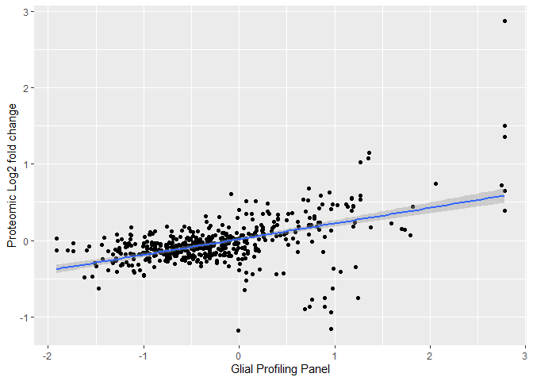
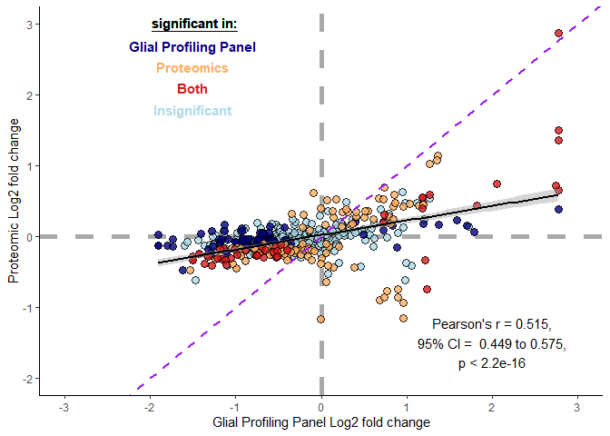
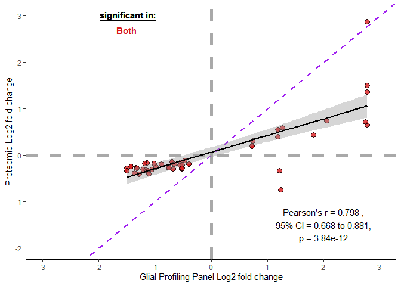
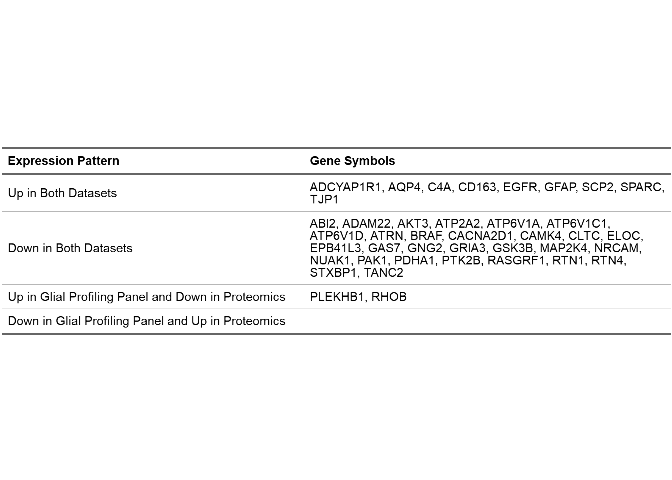

Differential Expression Analysis
================
Ashlyn Johnson

``` r
library(tidyverse)
library(readxl)
library(janitor)
library(ggrepel)
library(magick)
library(flextable)
library(knitr)
```

### Functions to fix gene symbols

See GO\_analysis\_2.md for explanation as to why I needed to make these
adjustments.

``` r
## function to fix nanostring dataframes 
correct_nanostring_gene_symbols <- function(df) {
  rbind(
    df %>%
      filter(str_detect(Probe.Label, "/") == FALSE),
    
    df %>%
      filter(str_detect(Probe.Label, "/")) %>%
      mutate(Probe.Label = str_remove_all(Probe.Label, "/[:alnum:]")),
    
    df %>%
      filter(str_detect(Probe.Label, "/")) %>%
      mutate(Probe.Label = str_remove_all(Probe.Label, "[:alnum:]/"))
  )
}

## function to fix proteomics dataframes 
update_proteomic_gene_symbols <- function(df) {
  df %>% 
    mutate(protein = str_replace_all(protein, c("VIMP" = "SELENOS", 
                                                "GPR124" = "ADGRA2", 
                                                "ATP5B" = "ATP5F1B", 
                                                "GPR56" = "ADGRG1", 
                                                "PTPLB" = "HACD2", 
                                                "ATP5F1" = "ATP5PB", 
                                                "SRPR" = "SRPRA", 
                                                "KIAA1161" = "MYORG", 
                                                "TCEB1" = "ELOC", 
                                                "ADRBK2" = "GRK3", 
                                                "MUT" = "MMUT",
                                                "ELTD1" = "ADGRL4")))
}
```

### Read in Data

``` r
# nanostring data

nanostring_diffex_FTD <- read_csv("raw_data/DEresults-DiseaseFTD.csv") %>% 
  dplyr::rename(Probe.Label = 1) %>% 
  dplyr::mutate(Probe.Label = str_replace_all(Probe.Label, c("TPSAB1/B2" = "TPSAB1/2")))  %>% 
  correct_nanostring_gene_symbols()
```

    ## New names:
    ## * `` -> ...1

    ## Rows: 682 Columns: 13

    ## -- Column specification --------------------------------------------------------
    ## Delimiter: ","
    ## chr (4): ...1, method, Gene.sets, probe.ID
    ## dbl (9): Log2 fold change, std error (log2), Lower confidence limit (log2), ...

    ## 
    ## i Use `spec()` to retrieve the full column specification for this data.
    ## i Specify the column types or set `show_col_types = FALSE` to quiet this message.

``` r
# proteomic data

proteomics_diffex <- read_xlsx("raw_data/TMT17.xlsx", sheet = "OriginalTMT2017") %>% 
  dplyr::rename(protein = `...1`, 
         protein_id = `...2`, 
         pval = `Pr(>F)`) %>% 
  clean_names()  %>% 
  update_proteomic_gene_symbols()
```

    ## New names:
    ## * `` -> ...1
    ## * `` -> ...2

#### How many diffex genes in FTD?

Manuscript will report the number identified in the Advanced Analysis
report. This number is for comparison between datasets.

``` r
# up
nanostring_diffex_FTD %>% 
  filter(BY.p.value <= .05) %>% 
  filter(`Log2 fold change` > 0) %>% 
  pull(Probe.Label) %>% 
  length()
```

    ## [1] 44

``` r
# down
nanostring_diffex_FTD %>% 
  filter(BY.p.value <= .05) %>% 
  filter(`Log2 fold change` < 0) %>% 
  pull(Probe.Label) %>% 
  length() 
```

    ## [1] 87

### Narrowing Down Nanostring Data

``` r
nanostring_diffex_FTD_refined <- nanostring_diffex_FTD %>%
  dplyr::select(Probe.Label,
         `Log2 fold change`,
         `P-value`,
         BY.p.value, 
         probe.ID) %>% 
  mutate(Probe.Label = str_remove_all(Probe.Label, "-mRNA")) %>% 
  rename(gene_name = Probe.Label)
```

### Narrowing Down Proteomic Data

Here, I only want the log2fold change values for FTD to control. With
that, I need to pull protein names, and p values for the post-hoc tests
comparing control and FTD groups.

``` r
proteomics_diffex_FTD <-  proteomics_diffex %>%
  dplyr::select(protein,
         protein_id,
         f_value,
         pval,
         diff_ftdp_control,
         ftdp_control) %>% 
  dplyr::rename(gene_name = protein, 
         protein_f_value = f_value, 
         protein_pval = pval,
         protein_diff_ftdp_control = diff_ftdp_control,
         protein_posthoc_pval = ftdp_control)
```

### Comparing Nanostring and Proteomics

First, I need to join the two dataframes. Then I will calculate
Pearson’s correlation values for all genes/proteins that are in both
datasets. And then for only genes/proteins that significant log2 fold
change values in both datasets.

#### Correlational analysis of nanostring and proteomic data

``` r
nano_protein_comparison <- inner_join(nanostring_diffex_FTD_refined, proteomics_diffex_FTD, by = "gene_name")


ggplot(data = nano_protein_comparison, aes(x = `Log2 fold change`, y = protein_diff_ftdp_control)) +
  geom_point() +
  geom_smooth(method = "lm") +
  labs(x = "Glial Profiling Panel", y = "Proteomic Log2 fold change")
```

    ## `geom_smooth()` using formula 'y ~ x'

<!-- -->

``` r
# all log 2 fold change values
total_protein_nano_comparison_plot <- ggplot(data = nano_protein_comparison, aes(x = `Log2 fold change`, y = protein_diff_ftdp_control)) +
  geom_hline(yintercept = 0, color = "darkgray", linetype = "dashed", size = 2) +
  geom_vline(xintercept = 0, color = "darkgray", linetype = "dashed", size = 2) +

  labs(x = "Glial Profiling Panel Log2 fold change", y = "Proteomic Log2 fold change") +
  scale_x_continuous(limits = c(-3, 3), breaks = -3:3) +
  scale_y_continuous(limits = c(-2, 3), breaks = -2:3) +
  # label points that were not significant in either dataset
  geom_point(data = nano_protein_comparison %>% 
               filter(BY.p.value > .05 & protein_posthoc_pval > .05), fill = "#abd9e9", alpha = .8, size = 3, shape = 21) +
# label points that only were significant in nanostring dataset
  geom_point(data = nano_protein_comparison %>% 
               filter(BY.p.value <= .05 & protein_posthoc_pval > .05), fill = "navy", alpha = .8, size = 3, shape = 21) +
# label points that were only significant in proteomic dataset
  geom_point(data = nano_protein_comparison %>% 
               filter(BY.p.value > .05 & protein_posthoc_pval <= .05), fill = "#fdae61", alpha = .8, size = 3, shape = 21) +
# label points that were significant in both datasets
  geom_point(data = nano_protein_comparison %>% 
               filter(BY.p.value <= .05 & protein_posthoc_pval <= .05), fill = "#d7191c", alpha = .8, size = 3, shape = 21) + 
  # geom_text_repel(data = nano_protein_comparison %>% 
  #                   filter(BY.p.value <= .05, 
  #                          protein_posthoc_pval <= .05) %>% 
  #                   sample_frac(0.5), 
  #                  aes(x = `Log2 fold change`, y = protein_diff_ftdp_control, label = gene_name)) + 
  annotate(geom = "text", x = -1.5, y = 3, xmin = -2, color = "black", label = ~underline(bold('significant in:'))) +
  annotate(geom = "text", x = -1.5, y = 2.7, color = "navy", label = "Glial Profiling Panel", fontface = "bold") +
  annotate(geom = "text", x = -1.5, y = 2.4, color = "#fdae61", label = "Proteomics", fontface = "bold") +
  annotate(geom = "text", x = -1.5, y = 2.1, color = "#d7191c", label = "Both", fontface = "bold") +
  annotate(geom = "text", x = -1.5, y = 1.8, color = "#abd9e9", label = "Insignificant", fontface = "bold") +
  geom_abline(slope = 1, color = "purple", linetype = "dashed", size = 1) +
  geom_smooth(method = "lm", color = "black", size = 1) +
  annotate(geom = "text", x = 2, y = -1.5, label = "Pearson's r = 0.515,\n95% CI =  0.449 to 0.575,\np < 2.2e-16") +
  theme_classic()
```

    ## Warning: Ignoring unknown aesthetics: xmin

``` r
cor.test(nano_protein_comparison$`Log2 fold change`, 
         nano_protein_comparison$protein_diff_ftdp_control, 
         method = "pearson", 
         alternative = "two.sided", 
         conf.level = 0.95)
```

    ## 
    ##  Pearson's product-moment correlation
    ## 
    ## data:  nano_protein_comparison$`Log2 fold change` and nano_protein_comparison$protein_diff_ftdp_control
    ## t = 13.763, df = 526, p-value < 2.2e-16
    ## alternative hypothesis: true correlation is not equal to 0
    ## 95 percent confidence interval:
    ##  0.4489499 0.5746675
    ## sample estimates:
    ##       cor 
    ## 0.5145688

``` r
total_protein_nano_comparison_plot
```

    ## `geom_smooth()` using formula 'y ~ x'

    ## Warning in is.na(x): is.na() applied to non-(list or vector) of type 'language'

<!-- -->

``` r
ggsave("figures/proteomic_comparison/total_protein_nano_comparison_plot_2.png")
```

    ## Saving 7 x 5 in image
    ## `geom_smooth()` using formula 'y ~ x'

    ## Warning in is.na(x): is.na() applied to non-(list or vector) of type 'language'

``` r
# only significant log 2 fold change values 

nano_protein_comparison_sig <- nano_protein_comparison %>%
  filter(BY.p.value <= .05,
         protein_posthoc_pval <= .05)

sig_protein_nano_comparison_plot <- ggplot(data = nano_protein_comparison_sig, aes(x = `Log2 fold change`, y = protein_diff_ftdp_control)) + 
  geom_hline(yintercept = 0, color = "darkgray", linetype = "dashed", size = 2) +
  geom_vline(xintercept = 0, color = "darkgray", linetype = "dashed", size = 2) +
  geom_point(alpha = .8, size = 3, shape = 21,  fill = "#d7191c") +
  labs(x = "Glial Profiling Panel Log2 fold change", y = "Proteomic Log2 fold change") +
  scale_x_continuous(limits = c(-3, 3), breaks = -3:3) +
  scale_y_continuous(limits = c(-2, 3), breaks = -2:3) +
  # geom_text_repel(data = nano_protein_comparison_sig, 
  #                  aes(x = `Log2 fold change`, y = protein_diff_ftdp_control, label = gene_name)) +
  annotate(geom = "text", x = -1.5, y = 3, color = "black", label = ~underline(bold('significant in:'))) +
  annotate(geom = "text", x = -1.5, y = 2.7, color = "#d7191c", label = "Both", fontface = "bold") +
  geom_abline(slope = 1, color = "purple", linetype = "dashed", size = 1) +
  geom_smooth(method = "lm", color = "black") +
  annotate(geom = "text", x = 2, y = -1.5, label = "Pearson's r = 0.798 ,\n95% CI = 0.668 to 0.881,\np = 3.84e-12") +
  theme_classic()

cor.test(nano_protein_comparison_sig$`Log2 fold change`, 
         nano_protein_comparison_sig$protein_diff_ftdp_control, 
         method = "pearson", alternative = "two.sided", 
         conf.level = 0.95)
```

    ## 
    ##  Pearson's product-moment correlation
    ## 
    ## data:  nano_protein_comparison_sig$`Log2 fold change` and nano_protein_comparison_sig$protein_diff_ftdp_control
    ## t = 9.1817, df = 48, p-value = 3.839e-12
    ## alternative hypothesis: true correlation is not equal to 0
    ## 95 percent confidence interval:
    ##  0.6684127 0.8808726
    ## sample estimates:
    ##       cor 
    ## 0.7982458

``` r
sig_protein_nano_comparison_plot
```

    ## `geom_smooth()` using formula 'y ~ x'

    ## Warning in is.na(x): is.na() applied to non-(list or vector) of type 'language'

<!-- -->

``` r
ggsave("figures/proteomic_comparison/sig_protein_nano_comparison_plot_2.png")
```

    ## Saving 7 x 5 in image
    ## `geom_smooth()` using formula 'y ~ x'

    ## Warning in is.na(x): is.na() applied to non-(list or vector) of type 'language'

#### Table of Gene Symbols

I want to illustrate genes that are up in both datasets, genes that are
down in both datasets, and genes that are up in one dataset but down in
the other.

``` r
# genes up in both datasets 
up_genes <- 
  nano_protein_comparison_sig %>% 
  filter(`Log2 fold change` > 0 & protein_diff_ftdp_control > 0) %>% 
  pull(gene_name) %>% 
  unique() %>% 
  sort() %>% 
  paste(collapse = ", ")

# genes down in both datasets
down_genes <- nano_protein_comparison_sig %>% 
  filter(`Log2 fold change` < 0 & protein_diff_ftdp_control < 0) %>% 
  pull(gene_name) %>% 
  unique() %>% 
  sort %>% 
  paste(collapse = ", ")

# genes up in nanostring and down in proteomics 
up_nano_down_protein <- nano_protein_comparison_sig %>% 
  filter(`Log2 fold change` > 0 & protein_diff_ftdp_control < 0) %>% 
  pull(gene_name) %>% 
  unique() %>% 
  sort() %>% 
  paste(collapse = ", ")

# genes down in nanostring and up in proteomics
down_nano_up_protein <- nano_protein_comparison_sig %>% 
  filter(`Log2 fold change` < 0 & protein_diff_ftdp_control > 0) %>% 
  pull(gene_name) %>% 
  unique() %>% 
  sort() %>% 
  paste(collapse = ", ")
## it appears that there are no genes down in nanostring and up in proteomics 

# now I will create a data frame with these strings 
sig_protein_nano_comparison_table <-
  cbind(
    c(
      "Up in Both Datasets",
      "Down in Both Datasets",
      "Up in Glial Profiling Panel and Down in Proteomics",
      "Down in Glial Profiling Panel and Up in Proteomics"
    ),
    c(
      up_genes,
      down_genes,
      up_nano_down_protein,
      down_nano_up_protein
    )
  ) %>%
  as.data.frame() %>%
  rename("Expression Pattern" = 1,
         "Gene Symbols" = 2) %>%
  flextable() %>%
  theme_vanilla() %>% 
  autofit() %>% 
  width(j = 2, width = 4.5)

plot(sig_protein_nano_comparison_table)
```

<!-- -->

``` r
#saving as an image
save_as_image(sig_protein_nano_comparison_table, path = "figures/proteomic_comparison/sig_protein_nano_comparison_table_2.png")
```

    ## [1] "C:/Users/ashly/Documents/HalesLab_AGJ_Local/JohnsonEtAl_GlialProfilingManuscript/figures/proteomic_comparison/sig_protein_nano_comparison_table_2.png"
