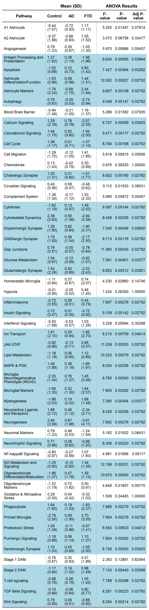

Pathway Score Analysis
================
Ashlyn Johnson

``` r
library(tidyverse)
library(rstatix)
library(ggsci)
library(knitr)
library(qwraps2)
library(flextable)
library(officer)
library(webshot2)
library(janitor)
library(officer)
sessionInfo()
```

    ## R version 4.1.1 (2021-08-10)
    ## Platform: x86_64-w64-mingw32/x64 (64-bit)
    ## Running under: Windows 10 x64 (build 19044)
    ## 
    ## Matrix products: default
    ## 
    ## locale:
    ## [1] LC_COLLATE=English_United States.1252 
    ## [2] LC_CTYPE=English_United States.1252   
    ## [3] LC_MONETARY=English_United States.1252
    ## [4] LC_NUMERIC=C                          
    ## [5] LC_TIME=English_United States.1252    
    ## 
    ## attached base packages:
    ## [1] stats     graphics  grDevices utils     datasets  methods   base     
    ## 
    ## other attached packages:
    ##  [1] janitor_2.1.0       webshot2_0.0.0.9000 officer_0.3.19     
    ##  [4] flextable_0.6.7     qwraps2_0.5.2       knitr_1.33         
    ##  [7] ggsci_2.9           rstatix_0.7.0       forcats_0.5.1      
    ## [10] stringr_1.4.0       dplyr_1.0.7         purrr_0.3.4        
    ## [13] readr_2.0.1         tidyr_1.1.3         tibble_3.1.4       
    ## [16] ggplot2_3.3.5       tidyverse_1.3.1    
    ## 
    ## loaded via a namespace (and not attached):
    ##  [1] fs_1.5.0            lubridate_1.7.10    httr_1.4.2         
    ##  [4] tools_4.1.1         backports_1.2.1     utf8_1.2.2         
    ##  [7] R6_2.5.1            DBI_1.1.1           colorspace_2.0-2   
    ## [10] withr_2.4.2         tidyselect_1.1.1    processx_3.5.2     
    ## [13] curl_4.3.2          compiler_4.1.1      cli_3.0.1          
    ## [16] rvest_1.0.1         xml2_1.3.2          scales_1.1.1       
    ## [19] systemfonts_1.0.2   digest_0.6.27       foreign_0.8-81     
    ## [22] rmarkdown_2.10      rio_0.5.27          base64enc_0.1-3    
    ## [25] pkgconfig_2.0.3     htmltools_0.5.2     dbplyr_2.1.1       
    ## [28] fastmap_1.1.0       rlang_0.4.11        readxl_1.3.1       
    ## [31] rstudioapi_0.13     generics_0.1.0      jsonlite_1.7.2     
    ## [34] zip_2.2.0           car_3.0-11          magrittr_2.0.1     
    ## [37] Rcpp_1.0.7          munsell_0.5.0       fansi_0.5.0        
    ## [40] abind_1.4-5         gdtools_0.2.3       lifecycle_1.0.0    
    ## [43] stringi_1.7.4       yaml_2.2.1          snakecase_0.11.0   
    ## [46] carData_3.0-4       grid_4.1.1          promises_1.2.0.1   
    ## [49] crayon_1.4.1        haven_2.4.3         chromote_0.0.0.9002
    ## [52] hms_1.1.0           ps_1.6.0            pillar_1.6.2       
    ## [55] uuid_0.1-4          reprex_2.0.1        glue_1.4.2         
    ## [58] evaluate_0.14       data.table_1.14.0   modelr_0.1.8       
    ## [61] vctrs_0.3.8         tzdb_0.1.2          cellranger_1.1.0   
    ## [64] gtable_0.3.0        assertthat_0.2.1    xfun_0.25          
    ## [67] openxlsx_4.2.4      broom_0.7.9         later_1.3.0        
    ## [70] websocket_1.4.1     ellipsis_0.3.2

### read in data

``` r
pathway_scores <- read_csv("raw_data/signature_scores.csv")
```

    ## New names:
    ## * `` -> ...1

    ## Rows: 24 Columns: 56

    ## -- Column specification --------------------------------------------------------
    ## Delimiter: ","
    ## chr  (1): ...1
    ## dbl (55): A1 Astrocyte, A2 Astrocyte, Angiogenesis, Antigen Processing and P...

    ## 
    ## i Use `spec()` to retrieve the full column specification for this data.
    ## i Specify the column types or set `show_col_types = FALSE` to quiet this message.

### Munge

``` r
pathway_scores <- pathway_scores %>%
  separate(1, c("Disease", "Case"), sep = "_") %>%
  mutate(Disease = factor(Disease, levels = c("Control", "AD", "FTD")))
```

### ANOVA

``` r
anova_results <- sapply(pathway_scores[, -c(1:2)], function(x) {
  lm(x ~ Disease, data = pathway_scores) %>%
    anova() %>%
    unlist()
})

adjusted_anova_results <- anova_results %>%
  t() %>%
  as.data.frame() %>%
  rownames_to_column("pathway") %>%
  select(pathway, Fval = "F value1", pval = "Pr(>F)1") %>%
  mutate(p.adjval = p.adjust(pval, method = "BY"))

significant_pathways <- adjusted_anova_results %>%
  filter(p.adjval <= .05) %>%
  pull(pathway)

kable(adjusted_anova_results, caption = "All One Way ANOVA Results with Correction for Multiple Tests")
```

| pathway                                      |       Fval |      pval |  p.adjval |
|:---------------------------------------------|-----------:|----------:|----------:|
| A1 Astrocyte                                 |  5.3250490 | 0.0134699 | 0.0791431 |
| A2 Astrocyte                                 |  3.0717751 | 0.0675776 | 0.3347724 |
| Angiogenesis                                 |  5.9699153 | 0.0088558 | 0.0545709 |
| Antigen Processing and Presentation          |  6.6335374 | 0.0058492 | 0.0399401 |
| Apoptosis                                    |  7.4267372 | 0.0036368 | 0.0328158 |
| Astrocyte DifferentiationFunction            | 12.5023967 | 0.0002654 | 0.0279183 |
| Astrocyte Markers                            |  9.6070317 | 0.0010898 | 0.0279183 |
| Autophagy                                    |  9.0475003 | 0.0014656 | 0.0279183 |
| Blood Brain Barrier                          |  5.2864636 | 0.0138196 | 0.0793526 |
| Calcium Signaling                            |  6.7066401 | 0.0055934 | 0.0392549 |
| Cannabinoid Signaling                        |  9.4713312 | 0.0011701 | 0.0279183 |
| Cell Cycle                                   |  8.7940038 | 0.0016809 | 0.0279183 |
| Cell Migration                               |  5.9180846 | 0.0091538 | 0.0550642 |
| Chemokines                                   |  0.9760565 | 0.3932462 | 1.0000000 |
| Cholinergic Synapse                          |  8.8322410 | 0.0016464 | 0.0279183 |
| Circadian Signaling                          |  5.1117095 | 0.0155331 | 0.0853133 |
| Complement System                            |  5.9950397 | 0.0087152 | 0.0545709 |
| Cytokines                                    |  9.0866500 | 0.0014352 | 0.0279183 |
| Cytoskeletal Dynamics                        |  8.4279629 | 0.0020554 | 0.0279183 |
| Dopaminergic Synapse                         |  7.0448480 | 0.0045595 | 0.0359984 |
| GABAergic Synapse                            |  8.7134715 | 0.0017564 | 0.0279183 |
| Gap Junctions                                | 11.3601135 | 0.0004530 | 0.0279183 |
| Glucose Metabolism                           |  7.2607351 | 0.0040100 | 0.0337710 |
| Glutamatergic Synapse                        |  6.8517127 | 0.0051215 | 0.0392099 |
| Homeostatic Microglia                        |  4.2300590 | 0.0285983 | 0.1474557 |
| Hypoxia                                      |  1.4242521 | 0.2630029 | 1.0000000 |
| Inflammasome                                 |  7.9067321 | 0.0027557 | 0.0279183 |
| Insulin Signaling                            |  9.1091680 | 0.0014180 | 0.0279183 |
| Interferon Signaling                         |  3.2276405 | 0.0599419 | 0.3028850 |
| Ion Transport                                |  6.2146360 | 0.0075853 | 0.0491386 |
| JAK-STAT                                     | 11.0393004 | 0.0005291 | 0.0279183 |
| Lipid Metabolism                             | 10.2228921 | 0.0007939 | 0.0279183 |
| MAPK & PI3K                                  |  8.0340979 | 0.0025632 | 0.0279183 |
| Microglia Neurodegenerative Phenotype (MGnD) |  6.7650322 | 0.0053980 | 0.0392549 |
| Microglial Markers                           |  7.8052307 | 0.0029204 | 0.0279183 |
| Myelogenesis                                 |  7.2902931 | 0.0039406 | 0.0337710 |
| Neuroactive Ligands and Receptors            |  8.4259744 | 0.0020577 | 0.0279183 |
| Neurogenesis                                 |  7.9018636 | 0.0027634 | 0.0279183 |
| Neuronal Markers                             |  5.1619917 | 0.0150174 | 0.0843138 |
| Neurotrophin Signaling                       |  8.3057401 | 0.0022001 | 0.0279183 |
| NF-kappaB Signaling                          |  4.9814985 | 0.0169610 | 0.0911739 |
| NO Metabolism and Signaling                  | 12.1889204 | 0.0003065 | 0.0279183 |
| Oligodendrocyte DifferentiationMaturation    | 10.6701761 | 0.0006344 | 0.0279183 |
| Oligodendrocyte Markers                      |  4.8483435 | 0.0185713 | 0.0977502 |
| Oxidative & Nitrosative Stress               |  1.5058312 | 0.2448326 | 1.0000000 |
| Phagocytosis                                 |  7.8847709 | 0.0027905 | 0.0279183 |
| Primed Microglia                             |  7.9043777 | 0.0027594 | 0.0279183 |
| Proteotoxic Stress                           |  6.5827765 | 0.0060343 | 0.0401197 |
| Purinergic Signaling                         |  7.8035116 | 0.0029233 | 0.0279183 |
| Serotonergic Synapse                         |  6.7259333 | 0.0055280 | 0.0392549 |
| Stage 1 DAM                                  |  2.2630867 | 0.1288109 | 0.6258442 |
| Stage 2 DAM                                  |  7.1034202 | 0.0044027 | 0.0358818 |
| T-cell signaling                             |  7.7679845 | 0.0029836 | 0.0279183 |
| TGF-Beta Signaling                           |  8.2807548 | 0.0022310 | 0.0279183 |
| Wnt Signaling                                |  8.3535451 | 0.0021422 | 0.0279183 |

All One Way ANOVA Results with Correction for Multiple Tests

### Pairwise T-Tests

``` r
# making a tidier data frame

pathway_scores_tidy <- pathway_scores %>%
  select(one_of(c("Disease", "Case", significant_pathways))) %>%
  pivot_longer(3:41,
    names_to = "pathway",
    values_to = "pathway_score"
  )
# doing the pairwise t tests
posthoc_t_test_results <- pathway_scores_tidy %>%
  group_by(pathway) %>%
  pairwise_t_test(data = ., pathway_score ~ Disease, pool.sd = TRUE, p.adjust = "none") %>%
  select(1:8) %>%
  mutate(p.adj = p.adjust(p, method = "BY"))

# noting just the significant posthoc results

sig_posthoc_t_test_results <- posthoc_t_test_results %>%
  filter(p.adj <= .05)

kable(posthoc_t_test_results, caption = "Pairwise T-Test Results for Pathways with Significant ANOVA P-Vals")
```

| pathway                                      | .y.            | group1  | group2 |  n1 |  n2 |        p | p.signif |     p.adj |
|:---------------------------------------------|:---------------|:--------|:-------|----:|----:|---------:|:---------|----------:|
| Antigen Processing and Presentation          | pathway\_score | Control | AD     |   8 |   8 | 2.23e-01 | ns       | 1.0000000 |
| Antigen Processing and Presentation          | pathway\_score | Control | FTD    |   8 |   8 | 1.73e-03 | \*\*     | 0.0318120 |
| Antigen Processing and Presentation          | pathway\_score | AD      | FTD    |   8 |   8 | 2.96e-02 | \*       | 0.2803963 |
| Apoptosis                                    | pathway\_score | Control | AD     |   8 |   8 | 3.32e-02 | \*       | 0.2923507 |
| Apoptosis                                    | pathway\_score | Control | FTD    |   8 |   8 | 9.72e-04 | \*\*\*   | 0.0225075 |
| Apoptosis                                    | pathway\_score | AD      | FTD    |   8 |   8 | 1.36e-01 | ns       | 0.8950344 |
| Astrocyte DifferentiationFunction            | pathway\_score | Control | AD     |   8 |   8 | 1.31e-02 | \*       | 0.1605926 |
| Astrocyte DifferentiationFunction            | pathway\_score | Control | FTD    |   8 |   8 | 6.07e-05 | \*\*\*\* | 0.0195738 |
| Astrocyte DifferentiationFunction            | pathway\_score | AD      | FTD    |   8 |   8 | 3.28e-02 | \*       | 0.2923507 |
| Astrocyte Markers                            | pathway\_score | Control | AD     |   8 |   8 | 2.90e-01 | ns       | 1.0000000 |
| Astrocyte Markers                            | pathway\_score | Control | FTD    |   8 |   8 | 3.83e-04 | \*\*\*   | 0.0195738 |
| Astrocyte Markers                            | pathway\_score | AD      | FTD    |   8 |   8 | 5.01e-03 | \*\*     | 0.0745784 |
| Autophagy                                    | pathway\_score | Control | AD     |   8 |   8 | 3.07e-02 | \*       | 0.2864758 |
| Autophagy                                    | pathway\_score | Control | FTD    |   8 |   8 | 3.59e-04 | \*\*\*   | 0.0195738 |
| Autophagy                                    | pathway\_score | AD      | FTD    |   8 |   8 | 6.70e-02 | ns       | 0.4928109 |
| Calcium Signaling                            | pathway\_score | Control | AD     |   8 |   8 | 6.12e-01 | ns       | 1.0000000 |
| Calcium Signaling                            | pathway\_score | Control | FTD    |   8 |   8 | 2.71e-03 | \*\*     | 0.0434439 |
| Calcium Signaling                            | pathway\_score | AD      | FTD    |   8 |   8 | 8.90e-03 | \*\*     | 0.1236522 |
| Cannabinoid Signaling                        | pathway\_score | Control | AD     |   8 |   8 | 2.57e-01 | ns       | 1.0000000 |
| Cannabinoid Signaling                        | pathway\_score | Control | FTD    |   8 |   8 | 3.89e-04 | \*\*\*   | 0.0195738 |
| Cannabinoid Signaling                        | pathway\_score | AD      | FTD    |   8 |   8 | 6.11e-03 | \*\*     | 0.0888377 |
| Cell Cycle                                   | pathway\_score | Control | AD     |   8 |   8 | 5.19e-02 | ns       | 0.3907549 |
| Cell Cycle                                   | pathway\_score | Control | FTD    |   8 |   8 | 4.09e-04 | \*\*\*   | 0.0195738 |
| Cell Cycle                                   | pathway\_score | AD      | FTD    |   8 |   8 | 4.49e-02 | \*       | 0.3585053 |
| Cholinergic Synapse                          | pathway\_score | Control | AD     |   8 |   8 | 1.91e-01 | ns       | 1.0000000 |
| Cholinergic Synapse                          | pathway\_score | Control | FTD    |   8 |   8 | 4.85e-04 | \*\*\*   | 0.0195738 |
| Cholinergic Synapse                          | pathway\_score | AD      | FTD    |   8 |   8 | 1.14e-02 | \*       | 0.1454565 |
| Cytokines                                    | pathway\_score | Control | AD     |   8 |   8 | 2.58e-02 | \*       | 0.2642007 |
| Cytokines                                    | pathway\_score | Control | FTD    |   8 |   8 | 3.56e-04 | \*\*\*   | 0.0195738 |
| Cytokines                                    | pathway\_score | AD      | FTD    |   8 |   8 | 7.81e-02 | ns       | 0.5612498 |
| Cytoskeletal Dynamics                        | pathway\_score | Control | AD     |   8 |   8 | 1.88e-01 | ns       | 1.0000000 |
| Cytoskeletal Dynamics                        | pathway\_score | Control | FTD    |   8 |   8 | 5.98e-04 | \*\*\*   | 0.0195738 |
| Cytoskeletal Dynamics                        | pathway\_score | AD      | FTD    |   8 |   8 | 1.42e-02 | \*       | 0.1675085 |
| Dopaminergic Synapse                         | pathway\_score | Control | AD     |   8 |   8 | 4.69e-01 | ns       | 1.0000000 |
| Dopaminergic Synapse                         | pathway\_score | Control | FTD    |   8 |   8 | 1.87e-03 | \*\*     | 0.0334040 |
| Dopaminergic Synapse                         | pathway\_score | AD      | FTD    |   8 |   8 | 1.03e-02 | \*       | 0.1370136 |
| GABAergic Synapse                            | pathway\_score | Control | AD     |   8 |   8 | 1.56e-01 | ns       | 0.9952289 |
| GABAergic Synapse                            | pathway\_score | Control | FTD    |   8 |   8 | 4.89e-04 | \*\*\*   | 0.0195738 |
| GABAergic Synapse                            | pathway\_score | AD      | FTD    |   8 |   8 | 1.51e-02 | \*       | 0.1716480 |
| Gap Junctions                                | pathway\_score | Control | AD     |   8 |   8 | 2.62e-02 | \*       | 0.2642007 |
| Gap Junctions                                | pathway\_score | Control | FTD    |   8 |   8 | 1.04e-04 | \*\*\*   | 0.0195738 |
| Gap Junctions                                | pathway\_score | AD      | FTD    |   8 |   8 | 2.72e-02 | \*       | 0.2657133 |
| Glucose Metabolism                           | pathway\_score | Control | AD     |   8 |   8 | 3.56e-02 | \*       | 0.3057523 |
| Glucose Metabolism                           | pathway\_score | Control | FTD    |   8 |   8 | 1.07e-03 | \*\*     | 0.0230680 |
| Glucose Metabolism                           | pathway\_score | AD      | FTD    |   8 |   8 | 1.38e-01 | ns       | 0.8987363 |
| Glutamatergic Synapse                        | pathway\_score | Control | AD     |   8 |   8 | 3.06e-01 | ns       | 1.0000000 |
| Glutamatergic Synapse                        | pathway\_score | Control | FTD    |   8 |   8 | 1.69e-03 | \*\*     | 0.0318120 |
| Glutamatergic Synapse                        | pathway\_score | AD      | FTD    |   8 |   8 | 1.86e-02 | \*       | 0.2004977 |
| Inflammasome                                 | pathway\_score | Control | AD     |   8 |   8 | 4.63e-03 | \*\*     | 0.0706027 |
| Inflammasome                                 | pathway\_score | Control | FTD    |   8 |   8 | 1.44e-03 | \*\*     | 0.0290419 |
| Inflammasome                                 | pathway\_score | AD      | FTD    |   8 |   8 | 6.24e-01 | ns       | 1.0000000 |
| Insulin Signaling                            | pathway\_score | Control | AD     |   8 |   8 | 4.79e-02 | \*       | 0.3697217 |
| Insulin Signaling                            | pathway\_score | Control | FTD    |   8 |   8 | 3.42e-04 | \*\*\*   | 0.0195738 |
| Insulin Signaling                            | pathway\_score | AD      | FTD    |   8 |   8 | 4.18e-02 | \*       | 0.3438643 |
| Ion Transport                                | pathway\_score | Control | AD     |   8 |   8 | 2.31e-01 | ns       | 1.0000000 |
| Ion Transport                                | pathway\_score | Control | FTD    |   8 |   8 | 2.25e-03 | \*\*     | 0.0380194 |
| Ion Transport                                | pathway\_score | AD      | FTD    |   8 |   8 | 3.57e-02 | \*       | 0.3057523 |
| JAK-STAT                                     | pathway\_score | Control | AD     |   8 |   8 | 8.52e-02 | ns       | 0.5918635 |
| JAK-STAT                                     | pathway\_score | Control | FTD    |   8 |   8 | 1.34e-04 | \*\*\*   | 0.0195738 |
| JAK-STAT                                     | pathway\_score | AD      | FTD    |   8 |   8 | 9.52e-03 | \*\*     | 0.1293908 |
| Lipid Metabolism                             | pathway\_score | Control | AD     |   8 |   8 | 2.32e-02 | \*       | 0.2417470 |
| Lipid Metabolism                             | pathway\_score | Control | FTD    |   8 |   8 | 1.89e-04 | \*\*\*   | 0.0195738 |
| Lipid Metabolism                             | pathway\_score | AD      | FTD    |   8 |   8 | 5.13e-02 | ns       | 0.3907549 |
| MAPK & PI3K                                  | pathway\_score | Control | AD     |   8 |   8 | 2.00e-01 | ns       | 1.0000000 |
| MAPK & PI3K                                  | pathway\_score | Control | FTD    |   8 |   8 | 7.52e-04 | \*\*\*   | 0.0195738 |
| MAPK & PI3K                                  | pathway\_score | AD      | FTD    |   8 |   8 | 1.62e-02 | \*       | 0.1808637 |
| Microglia Neurodegenerative Phenotype (MGnD) | pathway\_score | Control | AD     |   8 |   8 | 1.06e-02 | \*       | 0.1380667 |
| Microglia Neurodegenerative Phenotype (MGnD) | pathway\_score | Control | FTD    |   8 |   8 | 2.33e-03 | \*\*     | 0.0383351 |
| Microglia Neurodegenerative Phenotype (MGnD) | pathway\_score | AD      | FTD    |   8 |   8 | 5.19e-01 | ns       | 1.0000000 |
| Microglial Markers                           | pathway\_score | Control | AD     |   8 |   8 | 2.21e-02 | \*       | 0.2341880 |
| Microglial Markers                           | pathway\_score | Control | FTD    |   8 |   8 | 8.14e-04 | \*\*\*   | 0.0195738 |
| Microglial Markers                           | pathway\_score | AD      | FTD    |   8 |   8 | 1.66e-01 | ns       | 1.0000000 |
| Myelogenesis                                 | pathway\_score | Control | AD     |   8 |   8 | 3.89e-02 | \*       | 0.3286566 |
| Myelogenesis                                 | pathway\_score | Control | FTD    |   8 |   8 | 1.04e-03 | \*\*     | 0.0230680 |
| Myelogenesis                                 | pathway\_score | AD      | FTD    |   8 |   8 | 1.25e-01 | ns       | 0.8313934 |
| Neuroactive Ligands and Receptors            | pathway\_score | Control | AD     |   8 |   8 | 1.88e-01 | ns       | 1.0000000 |
| Neuroactive Ligands and Receptors            | pathway\_score | Control | FTD    |   8 |   8 | 5.98e-04 | \*\*\*   | 0.0195738 |
| Neuroactive Ligands and Receptors            | pathway\_score | AD      | FTD    |   8 |   8 | 1.42e-02 | \*       | 0.1675085 |
| Neurogenesis                                 | pathway\_score | Control | AD     |   8 |   8 | 1.89e-01 | ns       | 1.0000000 |
| Neurogenesis                                 | pathway\_score | Control | FTD    |   8 |   8 | 7.97e-04 | \*\*\*   | 0.0195738 |
| Neurogenesis                                 | pathway\_score | AD      | FTD    |   8 |   8 | 1.84e-02 | \*       | 0.2004977 |
| Neurotrophin Signaling                       | pathway\_score | Control | AD     |   8 |   8 | 3.39e-01 | ns       | 1.0000000 |
| Neurotrophin Signaling                       | pathway\_score | Control | FTD    |   8 |   8 | 7.94e-04 | \*\*\*   | 0.0195738 |
| Neurotrophin Signaling                       | pathway\_score | AD      | FTD    |   8 |   8 | 7.88e-03 | \*\*     | 0.1119690 |
| NO Metabolism and Signaling                  | pathway\_score | Control | AD     |   8 |   8 | 4.01e-02 | \*       | 0.3342778 |
| NO Metabolism and Signaling                  | pathway\_score | Control | FTD    |   8 |   8 | 7.12e-05 | \*\*\*\* | 0.0195738 |
| NO Metabolism and Signaling                  | pathway\_score | AD      | FTD    |   8 |   8 | 1.23e-02 | \*       | 0.1538011 |
| Oligodendrocyte DifferentiationMaturation    | pathway\_score | Control | AD     |   8 |   8 | 4.24e-03 | \*\*     | 0.0662720 |
| Oligodendrocyte DifferentiationMaturation    | pathway\_score | Control | FTD    |   8 |   8 | 2.05e-04 | \*\*\*   | 0.0195738 |
| Oligodendrocyte DifferentiationMaturation    | pathway\_score | AD      | FTD    |   8 |   8 | 2.16e-01 | ns       | 1.0000000 |
| Phagocytosis                                 | pathway\_score | Control | AD     |   8 |   8 | 1.12e-01 | ns       | 0.7529385 |
| Phagocytosis                                 | pathway\_score | Control | FTD    |   8 |   8 | 7.25e-04 | \*\*\*   | 0.0195738 |
| Phagocytosis                                 | pathway\_score | AD      | FTD    |   8 |   8 | 3.23e-02 | \*       | 0.2923507 |
| Primed Microglia                             | pathway\_score | Control | AD     |   8 |   8 | 5.25e-02 | ns       | 0.3907549 |
| Primed Microglia                             | pathway\_score | Control | FTD    |   8 |   8 | 6.89e-04 | \*\*\*   | 0.0195738 |
| Primed Microglia                             | pathway\_score | AD      | FTD    |   8 |   8 | 6.85e-02 | ns       | 0.4979853 |
| Proteotoxic Stress                           | pathway\_score | Control | AD     |   8 |   8 | 4.73e-02 | \*       | 0.3696542 |
| Proteotoxic Stress                           | pathway\_score | Control | FTD    |   8 |   8 | 1.64e-03 | \*\*     | 0.0318120 |
| Proteotoxic Stress                           | pathway\_score | AD      | FTD    |   8 |   8 | 1.47e-01 | ns       | 0.9474800 |
| Purinergic Signaling                         | pathway\_score | Control | AD     |   8 |   8 | 4.44e-02 | \*       | 0.3585053 |
| Purinergic Signaling                         | pathway\_score | Control | FTD    |   8 |   8 | 7.39e-04 | \*\*\*   | 0.0195738 |
| Purinergic Signaling                         | pathway\_score | AD      | FTD    |   8 |   8 | 8.49e-02 | ns       | 0.5918635 |
| Serotonergic Synapse                         | pathway\_score | Control | AD     |   8 |   8 | 3.95e-01 | ns       | 1.0000000 |
| Serotonergic Synapse                         | pathway\_score | Control | FTD    |   8 |   8 | 2.03e-03 | \*\*     | 0.0352548 |
| Serotonergic Synapse                         | pathway\_score | AD      | FTD    |   8 |   8 | 1.49e-02 | \*       | 0.1716480 |
| Stage 2 DAM                                  | pathway\_score | Control | AD     |   8 |   8 | 2.79e-02 | \*       | 0.2683585 |
| Stage 2 DAM                                  | pathway\_score | Control | FTD    |   8 |   8 | 1.25e-03 | \*\*     | 0.0260503 |
| Stage 2 DAM                                  | pathway\_score | AD      | FTD    |   8 |   8 | 1.88e-01 | ns       | 1.0000000 |
| T-cell signaling                             | pathway\_score | Control | AD     |   8 |   8 | 8.48e-02 | ns       | 0.5918635 |
| T-cell signaling                             | pathway\_score | Control | FTD    |   8 |   8 | 7.55e-04 | \*\*\*   | 0.0195738 |
| T-cell signaling                             | pathway\_score | AD      | FTD    |   8 |   8 | 4.53e-02 | \*       | 0.3585053 |
| TGF-Beta Signaling                           | pathway\_score | Control | AD     |   8 |   8 | 9.01e-02 | ns       | 0.6190245 |
| TGF-Beta Signaling                           | pathway\_score | Control | FTD    |   8 |   8 | 5.64e-04 | \*\*\*   | 0.0195738 |
| TGF-Beta Signaling                           | pathway\_score | AD      | FTD    |   8 |   8 | 3.30e-02 | \*       | 0.2923507 |
| Wnt Signaling                                | pathway\_score | Control | AD     |   8 |   8 | 1.06e-01 | ns       | 0.7203482 |
| Wnt Signaling                                | pathway\_score | Control | FTD    |   8 |   8 | 5.52e-04 | \*\*\*   | 0.0195738 |
| Wnt Signaling                                | pathway\_score | AD      | FTD    |   8 |   8 | 2.70e-02 | \*       | 0.2657133 |

Pairwise T-Test Results for Pathways with Significant ANOVA P-Vals

### Creating Results File

``` r
write_csv(adjusted_anova_results, "stats_results/pathway_analysis_anova.csv")
write_csv(posthoc_t_test_results, "stats_results/pathway_analysis_posthoc.csv")
```

### Plots with P-vals

Here, I only want to draw plots for the pathways that have significant
ANOVAs and significant post-hoc tests.

``` r
for (i in seq_along(significant_pathways)) {
  pathway_scores %>%
    ggplot(aes(x = Disease, y = .data[[significant_pathways[i]]])) +
    geom_boxplot(aes(fill = Disease), alpha = .8) +
    scale_fill_manual(values = c("turquoise2", "magenta4", "yellow3" )) +
    geom_point(size = 3) +
    ggtitle(significant_pathways[i]) +
    ylab("Pathway Score") +
    labs(subtitle = paste0("One Way ANOVA, adjusted p-value = ", adjusted_anova_results %>%
      filter(pathway == significant_pathways[i]) %>%
      select(p.adjval) %>%
      round(digits = 5))) +
    theme_classic() +
    theme(
      legend.position = "none",
      plot.title = element_text(hjust = 0.5, size = 20),
      axis.title = element_text(size = 15),
      axis.text = element_text(size = 13)
    )

  ggsave(paste0("figures/pathway_scores/", str_replace_all(significant_pathways[i], " ", ""), ".png"))
}
```

    ## Saving 7 x 5 in image
    ## Saving 7 x 5 in image
    ## Saving 7 x 5 in image
    ## Saving 7 x 5 in image
    ## Saving 7 x 5 in image
    ## Saving 7 x 5 in image
    ## Saving 7 x 5 in image
    ## Saving 7 x 5 in image
    ## Saving 7 x 5 in image
    ## Saving 7 x 5 in image
    ## Saving 7 x 5 in image
    ## Saving 7 x 5 in image
    ## Saving 7 x 5 in image
    ## Saving 7 x 5 in image
    ## Saving 7 x 5 in image
    ## Saving 7 x 5 in image
    ## Saving 7 x 5 in image
    ## Saving 7 x 5 in image
    ## Saving 7 x 5 in image
    ## Saving 7 x 5 in image
    ## Saving 7 x 5 in image
    ## Saving 7 x 5 in image
    ## Saving 7 x 5 in image
    ## Saving 7 x 5 in image
    ## Saving 7 x 5 in image
    ## Saving 7 x 5 in image
    ## Saving 7 x 5 in image
    ## Saving 7 x 5 in image
    ## Saving 7 x 5 in image
    ## Saving 7 x 5 in image
    ## Saving 7 x 5 in image
    ## Saving 7 x 5 in image
    ## Saving 7 x 5 in image
    ## Saving 7 x 5 in image
    ## Saving 7 x 5 in image
    ## Saving 7 x 5 in image
    ## Saving 7 x 5 in image
    ## Saving 7 x 5 in image
    ## Saving 7 x 5 in image

### Nice Table

Here is the code for how I generated the table. I ended up using the
`flextable` and saving the table as a PNG which I then embedded into
this document. `qwraps2` was useful for calculating and displaying mean
and standard deviation in a quick way:
`mean_sd(.x, denote_sd, "paren")`.

``` r
pathway_scores_summary_table <- pathway_scores %>%
  select(-Case) %>%
  group_by(Disease) %>%
  summarize(across(where(is.double), ~ mean_sd(.x, denote_sd = "paren"))) %>%
  t() %>%
  as.data.frame() %>%
  row_to_names(row_number = 1) %>%
  rownames_to_column() %>%
  rename(pathway = rowname) %>%
  left_join(adjusted_anova_results, by = "pathway") %>% # joining with anova results
  rename(Pathway = pathway,
         "F-value" = Fval,
         "P-value" = pval,
  ) %>%
  mutate(
    "F-value" = round(.data[["F-value"]], digits = 3),
    "P-value" = round(.data[["P-value"]], digits = 5),
    p.adjval = round(p.adjval, digits = 5)
  ) %>%
  flextable() %>% # piping into flextable
  add_header_row( # creating another header row to label mean(sd) and anova results
    values = c(
      "",
      "Mean (SD)",
      "Mean (SD)",
      "Mean (SD)",
      "ANOVA Results",
      "ANOVA Results",
      "ANOVA Results"
    )
  ) %>%
  merge_h(part = "header") %>%
  align(align = "center", part = "header") %>%
  align(align = "Center", part = "header") %>%
  vline( # creating vertical lines
    j = c("Pathway", "FTD"),
    border = fp_border(color = "gray"),
    part = "body"
  ) %>%
  bold(part = "header") %>%
  fontsize(i = 1, size = 14, part = "header") %>%
  fontsize(i = 2, size = 13, part = "header") %>%
  fontsize(size = 12, part = "body") %>%
  bg(i = ~ p.adjval <= .05, # highlighting the significant results 
     bg = "lightblue",
     part = "body") %>%
  set_header_labels(p.adjval = "Adj P-value")

pathway_scores_summary_table

# saving as an image

save_as_image(pathway_scores_summary_table, "stats_results/pathway_scores_table.png")
save_as_pptx(pathway_scores_summary_table, path = "stats_results/pathway_scores_table.pptx")
```



### Table with Only Significant Pathway Scores

``` r
sig_pathway_scores_summary_table <- 
  pathway_scores %>%
  select(-Case) %>%
  group_by(Disease) %>%
  summarize(across(where(is.double), ~ mean_sd(.x, denote_sd = "paren"))) %>%
  t() %>%
  as.data.frame() %>%
  row_to_names(row_number = 1) %>%
  rownames_to_column() %>%
  rename(pathway = rowname) %>%
  left_join(adjusted_anova_results, by = "pathway") %>% # joining with anova results
  rename(Pathway = pathway,
         "F-value" = Fval,
         "P-value" = pval,
  ) %>%
  mutate(
    "F-value" = round(.data[["F-value"]], digits = 3),
    "P-value" = round(.data[["P-value"]], digits = 5),
    p.adjval = round(p.adjval, digits = 5)
  ) %>%
  filter(p.adjval <= .05) %>% 
  flextable() %>% # piping into flextable
  add_header_row( # creating another header row to label mean(sd) and anova results
    values = c(
      "",
      "Mean (SD)",
      "Mean (SD)",
      "Mean (SD)",
      "ANOVA Results",
      "ANOVA Results",
      "ANOVA Results"
    )
  ) %>%
  merge_h(part = "header") %>%
  align(align = "center", part = "header") %>%
  align(align = "Center", part = "header") %>%
  vline( # creating vertical lines
    j = c("Pathway", "FTD"),
    border = fp_border(color = "gray"),
    part = "body"
  ) %>%
  bold(part = "header") %>%
  fontsize(i = 1, size = 14, part = "header") %>%
  fontsize(i = 2, size = 13, part = "header") %>%
  fontsize(size = 12, part = "body") %>%
  set_header_labels(p.adjval = "Adj P-value")

# saving as an image

save_as_image(sig_pathway_scores_summary_table, "stats_results/sig_pathway_scores_table.png")
```
