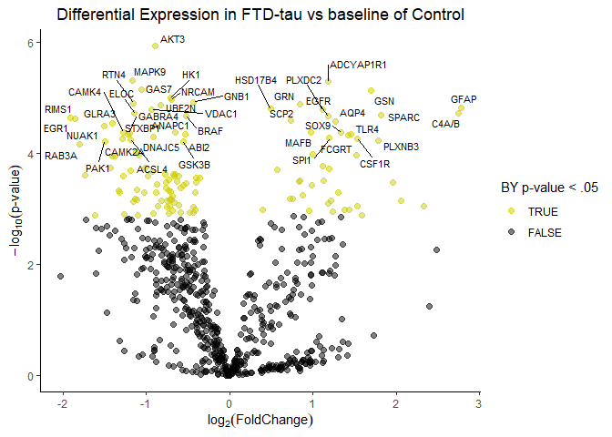
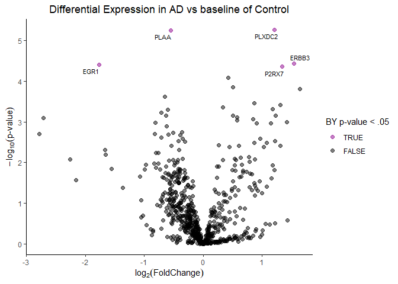
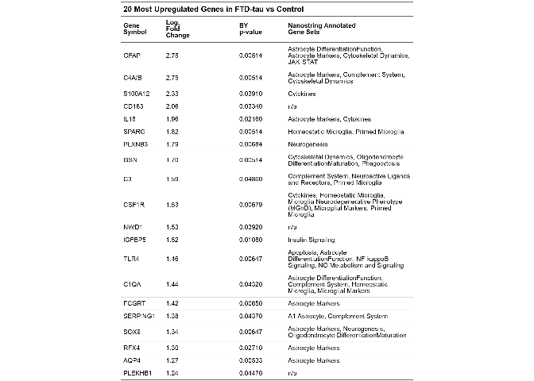
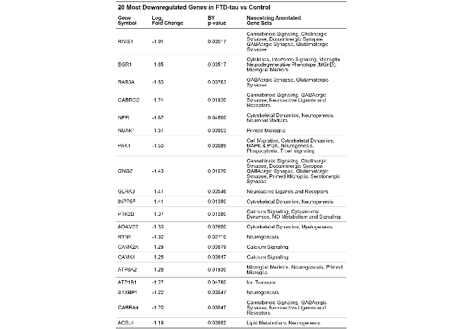
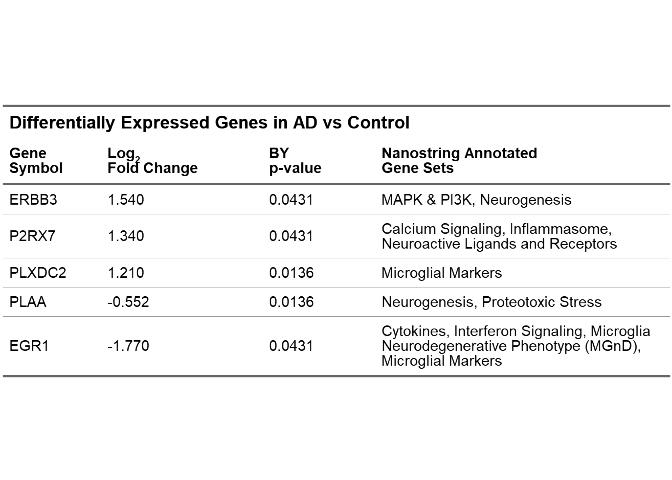

Volcano Plots from Nanostring Data
================
Ashlyn Johnson

``` r
library(tidyverse)
library(ggrepel)
library(flextable)
```

### Read in Data

``` r
diffex_FTD <- read_csv("raw_data/DEResults-DiseaseFTD.csv") %>% 
  rename(Gene = 1) %>% 
  mutate(Gene = str_remove_all(Gene, "-mRNA")) %>% 
  mutate(test = BY.p.value < .05)

diffex_AD <- read_csv("raw_data/DEResults-DiseaseAD.csv") %>% 
  rename(Gene = 1) %>% 
  mutate(Gene = str_remove_all(Gene, "-mRNA")) %>% 
  mutate(test = BY.p.value < .05)
```

### FTD Volcano Plot

``` r
# volcano plot

ggplot(diffex_FTD, aes(
  x = `Log2 fold change`,
  y = -log10(`P-value`),
  label = Gene
)) +
  geom_point(aes(color = test), size = 2, alpha = .5) +
  scale_color_manual(values = c("black", "yellow3")) +
  labs(
    color = "BY p-value < .05",
    y = expression(-log[10]("p-value")),
    x = expression(log[2]("FoldChange")),
    title = "Differential Expression in FTD-tau vs baseline of Control"
  ) +
  guides(color = guide_legend(reverse = TRUE)) +
  geom_text_repel(
    data = diffex_FTD %>%
      filter(BY.p.value < .01), 
    size = 3, 
    max.overlaps = Inf
  ) +
  theme_classic() +
  theme(plot.title = element_text(hjust = 0.5))
```

<!-- -->

``` r
# saving as image

ggsave("figures/volcano_ftdvsctrl.png")
```

    ## Saving 7 x 5 in image

### AD Volcano Plot

``` r
# volcano plot 

ggplot(diffex_AD, aes(
  x = `Log2 fold change`,
  y = -log10(`P-value`),
  label = Gene
)) +
  geom_point(aes(color = test), size = 2, alpha = .5) +
  scale_color_manual(values = c("black", "magenta4")) +
  # geom_hline(
  #   yintercept = -log10(0.05),
  #   color = "gray",
  #   linetype = 2
  # ) +
  labs(
    color = "BY p-value < .05",
    y = expression(-log[10]("p-value")),
    x = expression(log[2]("FoldChange")),
    title = "Differential Expression in AD vs baseline of Control"
  ) +
  guides(color = guide_legend(reverse = TRUE)) +
  geom_text_repel(data = diffex_AD %>%
                    filter(test == TRUE),
                  size = 3, 
                  max.overlaps = Inf) +
  theme_classic() +
  theme(plot.title = element_text(hjust = 0.5))
```

<!-- -->

``` r
# saving as image 

ggsave("figures/volcano_advsctrl.png")
```

    ## Saving 7 x 5 in image

### table of diffex genes in FTD

#### Up

``` r
# grabbing data 

diffex_FTD_up <- diffex_FTD %>%
  filter(`Log2 fold change` > 0) %>%
  filter(BY.p.value < .05) %>%
  arrange(desc(`Log2 fold change`)) %>%
  slice(1:20) %>%
  select(c(Gene, `Log2 fold change`, BY.p.value, Gene.sets)) %>% 
  replace_na(list("Gene.sets" = "n/a"))

# creating table 

diffex_FTD_up_table <- diffex_FTD_up %>%
  flextable() %>%
  # old name then new name
  set_header_labels("Gene" = "Gene Symbol",
                    "BY.p.value"  = "BY\np-value",
                    "Gene.sets" = "Nanostring Annotated\nGene Sets") %>%
  compose(
    i = 1,
    j = 2,
    part = "header",
    value = as_paragraph("Log", as_sub("2"), "\nFold\nChange")
  ) %>%
  add_header_lines(values = "20 Most Upregulated Genes in FTD-tau vs Control", top = TRUE) %>% 
  fontsize(i = 1, size = 13, part = "header") %>% 
  theme_vanilla() %>%
  autofit() %>% 
  width(j = 1, width = 1) %>% 
  width(j = 4, width = 3) %>% 
  align(align = "left", part = "all")

plot(diffex_FTD_up_table)
```

<!-- -->

``` r
save_as_image(diffex_FTD_up_table, path = "figures/diffex_FTD_up_table.png")
```

    ## [1] "C:/Users/ashly/Documents/HalesLab_AGJ_Local/JohnsonEtAl_GlialProfilingManuscript/figures/diffex_FTD_up_table.png"

#### Down

``` r
# grabbing data 

diffex_FTD_down <- diffex_FTD %>%
  filter(`Log2 fold change` < 0) %>%
  filter(BY.p.value < .05) %>%
  arrange(`Log2 fold change`) %>%
  slice(1:20) %>%
  select(c(Gene, `Log2 fold change`, BY.p.value, Gene.sets)) %>% 
  replace_na(list("Gene.sets" = "n/a"))

# creating table 

diffex_FTD_down_table <- diffex_FTD_down %>%
  flextable() %>%
  # old name then new name
  set_header_labels("Gene" = "Gene Symbol",
                    "BY.p.value"  = "BY\np-value",
                    "Gene.sets" = "Nanostring Annotated\nGene Sets") %>%
  compose(
    i = 1,
    j = 2,
    part = "header",
    value = as_paragraph("Log", as_sub("2"), "\nFold Change")
  ) %>%
  add_header_lines(values = "20 Most Downregulated Genes in FTD-tau vs Control", top = TRUE) %>% 
  fontsize(i = 1, size = 13, part = "header") %>% 
  theme_vanilla() %>%
  autofit() %>% 
  width(j = 1, width = 1) %>% 
  width(j = 4, width = 3) %>% 
  align(align = "left", part = "all")

plot(diffex_FTD_down_table)
```

<!-- -->

``` r
save_as_image(diffex_FTD_down_table, path = "figures/diffex_FTD_down_table.png")
```

    ## [1] "C:/Users/ashly/Documents/HalesLab_AGJ_Local/JohnsonEtAl_GlialProfilingManuscript/figures/diffex_FTD_down_table.png"

### table of diffex genes in AD

``` r
diffex_AD_table <- diffex_AD %>% 
  filter(BY.p.value < .05) %>% 
  arrange(desc(`Log2 fold change`)) %>% 
  select(c(Gene, `Log2 fold change`, BY.p.value, Gene.sets)) %>% 
  flextable() %>%
  # old name then new name
  set_header_labels("Gene" = "Gene Symbol",
                    "BY.p.value"  = "BY\np-value",
                    "Gene.sets" = "Nanostring Annotated\nGene Sets") %>%
  compose(
    i = 1,
    j = 2,
    part = "header",
    value = as_paragraph("Log", as_sub("2"), "\nFold Change")
  ) %>%
  add_header_lines(values = "Differentially Expressed Genes in AD vs Control", top = TRUE) %>% 
  fontsize(i = 1, size = 13, part = "header") %>% 
  theme_vanilla() %>%
  autofit() %>% 
  width(j = 1, width = 1) %>% 
  width(j = 4, width = 3) %>% 
  align(align = "left", part = "all")

plot(diffex_AD_table)
```

<!-- -->

``` r
save_as_image(diffex_AD_table, "figures/diffex_AD_table.png")
```

    ## [1] "C:/Users/ashly/Documents/HalesLab_AGJ_Local/JohnsonEtAl_GlialProfilingManuscript/figures/diffex_AD_table.png"
